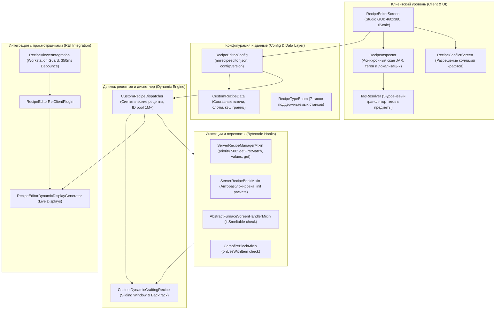

# Архитектурный чертёж и техническая спецификация мода [MR] Recipe Editor (Minecraft 1.21.4 Fabric)

Данный документ представляет собой исчерпывающий технический чертёж и архитектурный манифест модификации **[MR] Recipe Editor** для Minecraft 1.21.4 (Fabric). Документ предназначен для AI-агентов, системных архитекторов и разработчиков, которым необходимо понимать каждый нюанс реализации мода: от внутреннего устройства структур данных и алгоритмов сопоставления рецептов до тонкостей сетевой синхронизации, интеграции с просмотрщиками рецептов (REI) и низкоуровневых миксинов.

---

## 1. Концепция, окружение и философия проекта

### 1.1. Главная цель
Предоставление игроку и администратору локального сервера универсального внутриигрового инструмента для создания, просмотра, модификации и удаления рецептов любых предметов (как ванильного Minecraft, так и предметов из любых установленных модификаций) непосредственно во время игры через графический интерфейс, без необходимости ручного создания датапаков или перезапуска игрового клиента.

### 1.2. Философия «Чистого старта» (Clean Slate)
Мод принципиально **не добавляет** в игру никаких предустановленных пользовательских крафтов по умолчанию.
* При первом запуске словарь кастомных рецептов пуст (`recipes.isEmpty()`).
* При открытии графического редактора сетка крафта чиста; никакой рецепт не навязывается игроку.
* Все ванильные механики работают в неизменном виде до тех пор, пока пользователь явно не сохранит новый рецепт или не переопределит существующий.

### 1.3. Целевая платформа и зависимости
* **Minecraft:** 1.21.4.
* **Java:** 21 (LTS).
* **Fabric Loader:** `>= 0.16.0`.
* **Fabric API:** `0.115.0+1.21.4`.
* **Mod Menu:** `13.0.1` (обязательная зависимость в секции `depends` файла `fabric.mod.json`).
* **Roughly Enough Items (REI):** `18.0.815` (рекомендуемая зависимость `suggests`, официальная API-интеграция).
* **Среда выполнения:** Клиент и интегрированный сервер (Singleplayer / LAN).
* **Политика выделенного сервера (Dedicated Server Safety):** Выделенный сервер обнаруживается методом `FabricLoader.getInstance().getEnvironmentType() == EnvType.SERVER`. При запуске на Dedicated Server мод выводит понятный баннер в консоль и безопасно отключает свою работу без сбоев или блокировки запуска сервера.

---

## 2. Общая архитектура системы



---

## 3. Модели данных и конфигурация (`com.recipeeditor.config`)

### 3.1. Типы поддерживаемых станков (`RecipeTypeEnum`)
Перечисление описывает 7 категорий станков:
1. `SHAPED_CRAFTING` — верстак (сетка 3x3 с поддержкой как рецептов с формой, так и бесформенных). Трансляция: `block.minecraft.crafting_table`.
2. `SMITHING` — кузнечный стол (улучшение снаряжения по 3 слотам: шаблон, основа, материал). Трансляция: `block.minecraft.smithing_table`.
3. `SMELTING` — обычная печь (плавка руды и приготовление ресурсов, 1 входящий слот, тики и опыт). Трансляция: `block.minecraft.furnace`.
4. `BLASTING` — плавильня (быстрая переплавка металлов, 1 слот). Трансляция: `block.minecraft.blast_furnace`.
5. `SMOKING` — коптильня (быстрая готовка пищи, 1 слот). Трансляция: `block.minecraft.smoker`.
6. `STONECUTTING` — камнерез (обработка камня, 1 слот). Трансляция: `block.minecraft.stonecutter`.
7. `CAMPFIRE_COOKING` — костёр (жарка на открытом огне без топлива, 1 слот). Трансляция: `block.minecraft.campfire`.

Методы `fromRecipeType(RecipeType<?>)` и `toRecipeType()` обеспечивают двусторонний маппинг в ванильные типы реестра Minecraft.

### 3.2. Модель рецепта (`CustomRecipeData`)
Класс представляет универсальную сериализуемую модель рецепта:
* `id` (`String`): системный идентификатор крафта.
* `resultItemId` (`String`): идентификатор выходного предмета (например, `minecraft:totem_of_undying`).
* `resultCount` (`int`): количество выходных предметов (ограничено диапазоном от 1 до 1000).
* `type` (`RecipeTypeEnum`): тип станка.
* `patternSlots` (`String[9]`): массив из 9 строк для ингредиентов сетки. Пустые слоты содержат `"minecraft:air"`. Поддерживаются идентификаторы предметов (`minecraft:iron_ingot`) и теги (`#minecraft:planks`, `#c:iron_ingots`).
  * Для 1-слотовых станков (печи, камнерез, костер) используется только `patternSlots[0]`.
  * Для кузнечного стола используются: `patternSlots[0]` (шаблон), `patternSlots[1]` (основа), `patternSlots[2]` (дополнительный материал).
  * Для верстака задействованы все 9 слотов (построчно слева направо, сверху вниз).
* `experience` (`float`): опыт, выдаваемый за готовку в печи.
* `cookingTime` (`int`): время приготовления в тактах (тиках).
* `enabled` (`boolean`): активность рецепта в игре.
* `overrideExisting` (`boolean`): флаг подавления оригинального ванильного/модового рецепта с аналогичной формой или идентификатором.
* `overriddenId` (`String`): идентификатор подавляемого рецепта.
* `overriddenKey` (`String`): сигнатурный ключ подавляемого рецепта.
* `isShapeless` (`boolean`): признак бесформенного крафта на верстаке.
* `typeCounts` (`Map<String, Integer>`): кэш запоминания количества выходных предметов индивидуально для каждого типа станка при переключении кнопок в GUI.

#### Составные уникальные ключи и сигнатуры:
* `getPatternSignature()`: возвращает строку из 9 элементов, разделенных запятыми (`"slot0,slot1,...,slot8"`).
* `getKey()`: формирует уникальный ключ рецепта по формуле:
  `resultItemId + "#" + type.name() + (isShapeless ? "#SL#" : "#") + getPatternSignature()`.
  Это гарантирует бесконфликтное хранение нескольких вариантов крафта одного и того же предмета даже в пределах одного типа станка.

#### Расчет ограничивающего прямоугольника (Pattern Bounds):
Метод `computePatternBounds()` производит поиск минимальных и максимальных индексов строк и столбцов (`minRow`, `minCol`, `maxRow`, `maxCol`), вычисляя фактическую ширину `patternWidth` и высоту `patternHeight`. Значения кэшируются и сбрасываются через `invalidateCache()` при любом изменении слотов.

#### Безопасное разрешение ингредиентов тегов:
Метод `computeIngredientForSlot(int slot)` при обнаружении тега запрашивает `TagKey` из `Registries.ITEM`. **Критическое ухищрение:** если тег отсутствует в реестре (например, мир еще не загружен или мод удален), метод возвращает `Ingredient.ofItems()` (пустой несовпадающий ингредиент), а **не `null`**! Если бы возвращался `null`, незагруженный тег трактовался бы движком как воздух (`AIR`), и крафт случайно срабатывал бы от пустых ячеек верстака.

### 3.3. Менеджер конфигурации (`RecipeEditorConfig`)
* **Потокобезопасность:** Рецепты хранятся в `ConcurrentHashMap<String, CustomRecipeData> recipes`.
* **Быстрый кэш проверки:** Коллекция `Set<String> enabledResultIds = ConcurrentHashMap.newKeySet()` позволяет за $O(1)$ проверять наличие кастомного крафта у любого предмета в `hasCustomRecipe(String itemId)`.
* **Монотонное версионирование (`configVersion`):** Вместо хрупкого вычисления `hashCode()`, каждый вызов `save()`, `addOrUpdateRecipe()` или `removeRecipe()` инкрементирует целочисленный счетчик `configVersion++`. Все внешние компоненты, миксины и дисплеи инвалидируют свои кэши, сверяясь с этим числом.
* **Атомарное сохранение файла конфигурации (`save()`):**
  1. Файл сериализуется через Gson с отступами во временный файл `config/mrrecipeeditor.json.tmp`.
  2. Выполняется атомарная замена `Files.move(tmpPath, configPath, ATOMIC_MOVE, REPLACE_EXISTING)`.
  3. При возникновении `AtomicMoveNotSupportedException` выполняется безопасный fallback на стандартное перемещение с перезаписью.
  4. Автоматическая миграция: если существует устаревший файл `config/recipeeditor.json`, а новый `mrrecipeeditor.json` отсутствует, файл копируется автоматически.
* **Сортировка рецептов верстака (`getSortedCraftingRecipes()`):**
  Рецепты верстака кэшируются в отсортированном виде со следующими приоритетами:
  1. Рецепты с формой (`Shaped`) всегда проверяются **раньше**, чем бесформенные (`Shapeless`).
  2. Среди бесформенных рецептов первыми проверяются те, у которых **больше ингредиентов** (более специфичные рецепты имеют приоритет, что исключает ложное срабатывание рецепта из 2 ингредиентов при выкладывании 4).
  3. Для детерминизма одинаковые рецепты сортируются лексикографически по `getKey()`.

---

## 4. Динамический движок рецептов (`com.recipeeditor.recipe`)

### 4.1. Универсальный рецепт верстака (`CustomDynamicCraftingRecipe`)
Класс наследуется от ванильного `ShapedRecipe`, регистрируется через собственный сериализатор `custom_crafting` в реестре `Registries.RECIPE_SERIALIZER` и подменяет стандартную логику проверки совпадений:

#### Алгоритм скользящего окна (`matchesShaped`):
Позволяет рецептам с размерами меньше $3 \times 3$ (например, $2 \times 2$ или $1 \times 2$) собираться в абсолютно любом месте сетки верстака:
1. Вычисляются размеры шаблона `patternW` и `patternH`.
2. Если размеры входной сетки верстака `inputW` или `inputH` меньше размеров шаблона, возвращается `false`.
3. Запускаются циклы смещения `dx` (от 0 до `inputW - patternW`) и `dy` (от 0 до `inputH - patternH`).
4. Для каждого смещения `(dx, dy)` проверяется как прямое расположение, так и **горизонтально зеркальное** (`mirrored = true`).
5. Вспомогательный метод `checkMatchAt` проверяет:
   * Ячейки внутри окна шаблона должны удовлетворять `expectedIngredient.test(actualStack)`.
   * Все ячейки входной сетки **за пределами** текущего окна шаблона обязаны быть строго пустыми (`actual.isEmpty()`).

#### Алгоритм поиска с возвратом для бесформенных крафтов (`matchesShapeless`):
1. Проверяется точное совпадение количества непустых предметов на верстаке с количеством требуемых ингредиентов.
2. Метод `matchShapelessBacktrack` выполняет рекурсивное сопоставление предметов со списком ингредиентов с использованием массива флагов `usedIngs`, находя максимальное паросочетание без создания избыточных перестановок.

#### Мемоизация последнего ввода (Input Cache):
Метод `findMatchingRecipe` запоминает `lastInput`, `lastMatchedRecipe` и `lastInputConfigVersion`. Если игрок не менял предметы на верстаке, повторная проверка сотен рецептов пропускается, возвращая мгновенный результат за $O(1)$.

#### Защита от потери предметов при Shift-клике (`craft()`):
В методе `craft()` размер результирующего стака строго ограничивается максимальным размером пачки самого предмета:
```java
int safeCount = Math.min(resultItem.getMaxCount(), Math.max(1, matched.getResultCountForType(matched.type)));
return new ItemStack(resultItem, safeCount);
```
Это предотвращает баги с уничтожением предметов при быстром заборе через Shift, даже если в конфигураторе было задано количество до 1000 единиц.

### 4.2. Центральный диспетчер рецептов (`CustomRecipeDispatcher`)
Класс объединяет все типы станков, генерирует синтетические ванильные рецепты и управляет синхронизацией книги рецептов Minecraft 1.21.4.

#### Синтетическая фабрика рецептов (`createSyntheticRecipe`):
Создает полноценные объекты ванильных классов Minecraft на лету:
* `ShapedRecipe` / `ShapelessRecipe` (верстак).
* `SmeltingRecipe` (печь).
* `BlastingRecipe` (плавильня).
* `SmokingRecipe` (коптильня).
* `CampfireCookingRecipe` (костёр).
* `StonecuttingRecipe` (камнерез).
* `SmithingTransformRecipe` (кузнечный стол).

#### Автоматическая категоризация предметов:
Для корректной фильтрации в ванильной книге рецептов реализованы методы:
* `getCraftingCategory(Item)`: анализирует класс предмета. Оружие, броня, щиты, луки, булавы классифицируются как `EQUIPMENT`; блоки редстоуна, поршни, воронки, дропперы и автокрафтеры — как `REDSTONE`; остальные блоки — как `BUILDING`; прочее — как `MISC`.
* `getCookingCategory(Item)`: еда классифицируется как `FOOD`, блоки — как `BLOCKS`.

#### Механизм подавления оригинальных рецептов (Overrides):
Методы `isRecipeOverridden(RecipeEntry<?>)`, `isIdentifierOverridden(Identifier)` и `isIdOverridden(String)` используют кэшированные множества `cachedOverriddenIds` и `cachedOverriddenIdentifiers`. Они проверяют точные совпадения идентификаторов датапаков (`minecraft:iron_sword`), короткие имена путей (`iron_sword`) и сигнатуры, полностью блокируя выполнение ванильного крафта, если пользователь переопределил его в моде.

---

## 5. Ванильная книга рецептов 1.21.4 и сетевая синхронизация

В Minecraft 1.21.4 архитектура книги рецептов претерпела кардинальные изменения: рецепты на клиенте и сервере идентифицируются структурой `NetworkRecipeId`, а их графическое представление оформляется через `RecipeDisplayEntry` и `RecipeDisplay`.

### 5.1. Пул динамических идентификаторов `NetworkRecipeId`
Чтобы кастомные рецепты мода не конфликтовали с системными ванильными рецептами (имеющими малые порядковые индексы $0..999\,999$), диспетчер мода выделяет независимый изолированный диапазон индексов от одного миллиона:
```java
public static int getBaseNetworkId(String recipeKey) {
    if (recipeKey == null) return 1_000_000;
    return 1_000_000 + ((recipeKey.hashCode() & 0x7FFFFFFF) % 80_000_000) * 10;
}
```
Каждый дисплей рецепта получает свой уникальный `NetworkRecipeId(baseNetId + d)`.

### 5.2. Сетевые пакеты синхронизации книги рецептов
* **Подключение игрока к миру (`ServerPlayConnectionEvents.JOIN`):**
  Метод `sendCustomRecipeBookEntries` генерирует для подключившегося игрока пакет `RecipeBookAddS2CPacket` со списком всех кастомных `RecipeDisplayEntry`.
* **Синхронизация на лету при изменении конфигурации (`syncRecipeBookToPlayers`):**
  Диспетчер вычисляет разность (дельту) между ранее отправленными `PREVIOUS_NETWORK_IDS` и новым набором:
  1. Для удаленных рецептов рассылается пакет `RecipeBookRemoveS2CPacket(oldIds)`.
  2. Для добавленных рецептов рассылается пакет `RecipeBookAddS2CPacket(entries, false)`.
  3. Книга рецептов у всех игроков обновляется мгновенно, без переподключения к серверу.

### 5.3. Автозаполнение сетки верстака из книги рецептов (`CraftRequestC2SPacket`)
Когда игрок кликает по рецепту в ванильной книге, клиент отправляет пакет запроса автозаполнения с указанием `NetworkRecipeId`. На сервере ванильный `ServerRecipeManager.get(NetworkRecipeId)` перехватывается миксином `ServerRecipeManagerMixin`, который возвращает зарегистрированный в диспетчере `ServerRecipeManager.ServerRecipe`. В результате ванильный алгоритм раскладывает предметы из инвентаря в сетку верстака без единой ошибки.

---

## 6. Система инжекций байткода (`com.recipeeditor.mixin`)

Мод использует библиотеку Mixin с повышенным приоритетом (`priority = 500`), что гарантирует корректную работу в связке с оптимизаторами рецептов (FastSuite, Recipe Essentials и др.).

### 6.1. `ServerRecipeManagerMixin`
Центральная точка перехвата серверной рецептурной логики:
1. `@Inject getFirstMatch` (все три сигнатуры: обычная, с последним рецептом, по ключу реестра):
   * На входе (`HEAD`): запрашивает у `CustomRecipeDispatcher` кастомный рецепт. Если найден — отменяет оригинальный поиск и возвращает кастомный.
   * На выходе (`RETURN`): если ванильный рецепт найден, но помечен как переопределенный (`isRecipeOverridden`), возвращаемое значение подменяется на `Optional.empty()`.
2. `@Inject getStonecutterRecipes` и `getStonecutterRecipeForSync`:
   * Перехватывает списки рецептов камнереза, объединяет ванильные и кастомные группы `CuttingRecipeDisplay.Grouping<StonecuttingRecipe>`, фильтруя подавленные.
3. `@Inject values()`:
   * Фильтрует коллекцию всех рецептов сервера, удаляя переопределенные ванильные и подмешивая сгенерированные кастомные синтетические рецепты.
4. `@Inject get(RegistryKey)`:
   * Обеспечивает извлечение синтетического рецепта мода по его динамическому ключу реестра.
5. `@Inject get(NetworkRecipeId)`:
   * При индексах $\ge 1\,000\,000$ возвращает кастомный `ServerRecipe` для штатной обработки автокрафта.
6. `@Inject forEachRecipeDisplay`:
   * Рассылает дисплеи для ключей рецептов пространства имен `recipeeditor` и блокирует вызовы для переопределенных рецептов.

### 6.2. `ServerRecipeBookMixin`
* `@Inject isUnlocked`:
  * Для любых рецептов с namespace `recipeeditor` немедленно возвращает `true`, снимая требование получения ачивок.
  * Для подавленных ванильных рецептов немедленно возвращает `false`, скрывая их из интерфейса книги.
* `@Inject sendInitRecipesPacket`:
  * При отправке базового пакета книги рецептов клиенту гарантированно отправляет записи мода через `CustomRecipeDispatcher.sendCustomRecipeBookEntries`.

### 6.3. `AbstractFurnaceScreenHandlerMixin`
* `@Inject isSmeltable`:
  * Перехватывает проверку возможности плавки предмета в плавильнях, коптилках и обычных печах.
  * Если для предмета зарегистрирован кастомный рецепт плавки — возвращает `true`.
  * Если ванильный крафт плавки подавлен в моде — возвращает `false` (как на сервере, так и на клиенте).

### 6.4. `CampfireBlockMixin`
* `@Inject onUseWithItem`:
  * Перехватывает клик правой кнопкой мыши с предметом по костру.
  * При обнаружении кастомного рецепта костра корректно укладывает предмет в `CampfireBlockEntity` на сервере или потребляет анимацию на клиенте.

### 6.5. `TextFieldWidgetAccessor`
Клиентский интерфейс доступа (Accessor), открывающий защищенное ванильное поле `firstCharacterIndex` у `TextFieldWidget`, необходимое для посимвольного выделения текста мышью в кастомных полях ввода.

---

## 7. Интеграция с просмотрщиками рецептов (Roughly Enough Items / REI)

Интеграция реализована через официальное Fabric API Roughly Enough Items (`com.recipeeditor.integration.rei` и `com.recipeeditor.integration`).

### 7.1. Официальный клиентский плагин (`RecipeEditorReiClientPlugin`)
Реализует интерфейс `REIClientPlugin` с точкой входа `rei_client` в `fabric.mod.json`:
* `registry.registerGlobalDisplayGenerator(new RecipeEditorDynamicDisplayGenerator())` — регистрирует динамический генератор дисплеев, обеспечивающий мгновенный поиск рецептов и применений на лету.
* `registry.registerVisibilityPredicate(...)` — регистрирует предикат видимости, скрывающий оригинальные рецепты ванильного Minecraft или других модов, если они были переопределены в редакторе.

### 7.2. Динамический генератор дисплеев (`RecipeEditorDynamicDisplayGenerator`)
Реализует интерфейс `DynamicDisplayGenerator<Display>` и обрабатывает три сценария:
1. `getRecipeFor(EntryStack)` — игрок нажал клавишу просмотра рецепта (по умолчанию 'R') на предмете.
2. `getUsageFor(EntryStack)` — игрок нажал клавишу просмотра применений (по умолчанию 'U') на ингредиенте.
3. `generate(ViewSearchBuilder)` — игрок просматривает общие категории станков в REI.

Генератор динамически конструирует нативные дисплеи REI:
* `DefaultCustomShapedDisplay` и `DefaultCustomShapelessDisplay` для верстака.
* `DefaultSmeltingDisplay`, `DefaultBlastingDisplay`, `DefaultSmokingDisplay` для печей.
* `DefaultStoneCuttingDisplay` для камнереза.
* `DefaultCampfireDisplay` для костра.
* `DefaultSmithingDisplay` для кузнечного стола.

### 7.3. Менеджер обновления и защита рабочих станций (`RecipeViewerIntegration`)
* **Workstation Guard (Защита от фризов во время крафта):**
  При сохранении или удалении рецепта перезагрузка REI откладывается, если у игрока открыт любой контейнер или рабочий станок (`client.currentScreen instanceof HandledScreen`). Это исключает зависание графического интерфейса и сброс курсора прямо во время взаимодействия с верстаком или сундуком.
* **Debounce (Устранение дребезга перезагрузок):**
  Перезапуск просмотрщиков выполняется в фоновом пуле `ScheduledExecutorService` с задержкой в 350 мс. Серия быстрых сохранений объединяется в один единственный вызов.
* **Высокоскоростной MethodHandle:**
  Для вызова `DisplayRegistry.getDisplayOrigin` создается кэшированный `MethodHandle`, исключающий накладные расходы Java Reflection при фильтрации сотен дисплеев в кадре.

---

## 8. Инспектор рецептов, декомпилятор и транслятор тегов (`com.recipeeditor.inspector`)

### 8.1. Пятиуровневый транслятор тегов (`TagResolver`)
Позволяет сопоставлять теги предметов (`#minecraft:planks`, `#c:iron_ingots`) с реальными объектами `Item` в любых условиях:
1. **Уровень 1 (World Registry):** Динамический поиск по активному `RegistryManager` клиентского мира.
2. **Уровень 2 (Static Registry):** Запрос через `Registries.ITEM.iterateEntries(tagKey)`.
3. **Уровень 3 (Scanned Mod JSON):** Поиск по распарсенной карте `TAG_ITEMS`, полученной при фоновом сканировании JAR-файлов модов (`data/<ns>/tags/item/*.json`).
4. **Уровень 4 (Static Fallback Dictionary):** Встроенный статический словарь соответствий для популярных ванильных и конвенционных Fabric/Common тегов (доски, слитки, палки, шерсть, руды, красители, стекло).
5. **Уровень 5 (Heuristic Keyword Matching):** Эвристический анализ подстрок в названии тега (`plank` $\to$ дубовые доски, `stone` $\to$ камень, `ingot` $\to$ слиток и т.д.).

### 8.2. Фоновый инспектор рецептов (`RecipeInspector`)
* **Асинхронное сканирование JAR при старте (`startJarScanAsync`):**
  При запуске клиента в отдельном потоке сканируются все подключенные моды (`FabricLoader.getAllMods()`), извлекая рецепты и теги без блокировки экрана загрузки игры.
* **Синтетическая декомпиляция специальных рецептов ванилы:**
  Minecraft содержит рецепты, генерируемые кодом без прямых JSON файлов. Инспектор автоматически воссоздает их для игрока:
  * Незеритовые кузнечные рецепты (шлем, нагрудник, поножи, ботинки, меч, лопата, кирка, топор, мотыга) $\to$ шаблон `netherite_upgrade_smithing_template` + алмазный аналог + `netherite_ingot`.
  * Перекраска мешков (все 16 цветов).
  * Перекраска шерсти, кроватей, свечей, шалкеровых ящиков и ковров из любого исходного цвета.
* **Мультиязычный поиск и инверсия раскладки клавиатуры:**
  * Индексирует языковые файлы (`assets/<ns>/lang/*.json`) и кэш ассетов лаунчера (`.minecraft/assets/indexes/*.json`, файлы хэшей `ru_ru.json`, `uk_ua.json`). Поиск на русском языке («палка», «железо») находит предметы даже при включенном английском языке игры.
  * Метод `flipKeyboardLayout` автоматически транслирует опечатки раскладки (QWERTY $\leftrightarrow$ ЙЦУКЕН), позволяя находить предметы при случайном вводе «njntv» вместо «тотем» или «ghbdtn» вместо «привет».

---

## 9. Разрешение конфликтов рецептов (`RecipeConflictScreen`)

При сохранении рецепта метод `RecipeInspector.findConflicts` проверяет потенциальные коллизии:
* Анализируются кастомные, ванильные и модовые рецепты для **других** предметов на том же станке.
* Для верстака вычисляются нормализованные границы и проверяется как прямое совпадение, так и зеркальное.
* При обнаружении пересечений открывается модальный экран `RecipeConflictScreen`:
  * Отображается визуальная карточка конфликта с мини-сеткой крафта и стрелкой.
  * Выводится результат крафта с всплывающими подсказками, точным ID рецепта и источником (Ванильный Minecraft, название мода или «Мои крафты»).
  * Предоставляется выбор: **«Заменить (Override)»** (сохраняет кастомный рецепт и подавляет оригинальный) или **«Отмена»**.

---

## 10. Пользовательский интерфейс: Recipe Studio GUI (`com.recipeeditor.client.gui`)

### 10.1. Адаптивный экран редактора (`RecipeEditorScreen`)
* **Базовые габариты:** Базовое разрешение интерфейса $460 \times 380$ пикселей с динамическим расчетом масштаба `uiScale = Math.min(width / 460f, height / 380f)`.
* **Левая панель (Студия крафта):**
  * Пагинатор выбора типа станка (2 колонки кнопок, до 10 типов на страницу).
  * Переключатель формы для верстака: `[С формой]` / `[Без формы]`.
  * Панель навигатора вариантов рецепта: `[ ◀ ] [ Вариант N / M ] [ ▶ / + ]` с возможностью ввода номера варианта вручную.
  * Интерактивная сетка крафта со слотами $24 \times 24$ пикселя, подсветкой активного слота и стрелкой результата.
  * Динамические поля ввода времени плавки (в тиках с подсказкой в секундах) и опыта (XP) для печей.
  * Поле ввода количества выходных предметов (до 1000 шт.) с кнопками `[-]` и `[+]`.
  * Кнопки действий в правом нижнем углу: «Сохранить крафт», «Очистить сетку», «Удалить вариант», «Удалить крафт».
* **Правая панель (Каталог предметов):**
  * Горизонтальная карусель вкладок модов (`[Все]`, `[Minecraft]`, `[Моды...]`) с независимой прокруткой колесиком мыши.
  * Строка поиска с кнопкой мгновенной очистки `[✕]`.
  * Кнопки быстрых фильтров: `[Все]`, `[Без крафта]`, `[С крафтом]`, `[Мои крафты]`.
  * Сетка предметов ($10 \times 5 = 50$ предметов на страницу) с пагинацией.
* **Drag & Drop манипуляции:**
  * Зажатие ЛКМ по предмету в каталоге или слоте запускает режим перетаскивания.
  * Отрисовывается плавающий полупрозрачный стек предмета под курсором мыши.
  * Отпускание кнопки мыши над слотом сетки укладывает предмет в слот.
* **Горячие клавиши управления:**
  * `ПКМ по предмету каталога` — инспекция и загрузка рецепта в редактор.
  * `ПКМ по слоту крафта` — очистка слота.
  * `Delete` / `Backspace` — очистка выбранного слота или сброс выбранного целевого предмета.
  * `I` — показать / скрыть блок помощи и подсказок.
  * `Колесико мыши над сеткой крафта` — переключение вариантов рецепта.
  * `Колесико мыши над каталогом / вкладками` — независимая прокрутка страниц или вкладок.
* **Проверка прав создателя мира (`hasEditPermission`):**
  Редактирование разрешено только в главном меню, в одиночной игре или хосту локальной сети (`isIntegratedServerRunning() && isHost()`). На чужих серверах интерфейс переходит в режим чтения с выводом предупреждающего сообщения.
* **Кастомное текстовое поле с выделением (`SelectableTextFieldWidget`):**
  Позволяет выделять текст курсором мыши, поддерживает двойной клик для выделения всего текста и точно вычисляет координаты символов через миксин `TextFieldWidgetAccessor`.

---

## 11. Руководство для разработчиков: Добавление нового станка

Чтобы расширить мод и добавить поддержку нового типа станка (например, ткацкого станка или кастомного механизма из мода), выполните следующие шаги:

1. **Добавить элемент в `RecipeTypeEnum`:**
   * Задайте уникальное имя, ключ названия блока и ключ всплывающей подсказки.
   * Добавьте обработку в методы `fromRecipeType()` и `toRecipeType()`.
2. **Настроить сопоставление в `CustomRecipeDispatcher`:**
   * В методе `matchesInput` добавьте проверку типа входных данных (`RecipeInput`).
   * В методе `createSyntheticRecipe` добавьте ветку генерации соответствующего ванильного класса рецепта.
3. **Обновить генератор дисплеев REI (`RecipeEditorDynamicDisplayGenerator`):**
   * В методе `getCategoryForEnum` верните категорию REI `CategoryIdentifier<?>`.
   * В методе `createDisplay` добавьте сборку соответствующего `Display` (например, нативного дисплея из плагина мода).
4. **Обновить отрисовку в `RecipeEditorScreen`:**
   * В методе `renderCraftingGrid` определите геометрию отображения слотов (1 слот, 2 слота или нестандартная сетка).
   * В методе `saveCurrentCraft` настройте сбор ингредиентов из слотов.
5. **Добавить ключи локализации:**
   * Пропишите переводы названия станка и подсказок в `assets/recipeeditor/lang/ru_ru.json` и `en_us.json`.

---

## 12. Стандарты оформления коммитов (Commit Message Guidelines)

Все коммиты в репозитории проекта должны строго соответствовать следующим правилам:

1. **Заголовок коммита (Subject Line):**
   * Составляется исключительно на **английском языке**.
   * Используется повелительное наклонение (Imperative mood): `Fix ...`, `Add ...`, `Refactor ...`, `Update ...`, `Optimize ...`.
   * Запрещено ставить точку в конце заголовка.
   * Длина заголовка предпочтительно не должна превышать 72 символа.
2. **Разделитель:** Обязательная пустая строка между заголовком и телом коммита.
3. **Тело коммита (Body):**
   * Маркированный список конкретных изменений: `- <Компонент/Класс/Файл>: <описание сути изменения>`.
   * Технически точное объяснение причин правок, архитектурных решений и исправленных краевых случаев.

**Пример идеального коммита:**
```text
Fix shaped recipe sliding matching, LAN permissions, and GUI freeze

- CustomDynamicCraftingRecipe: implement sliding window (dx, dy) matching for recipes smaller than 3x3
- RecipeEditorScreen: verify integrated server host to prevent unauthorized LAN changes
- RecipeInspector: scan mod JARs asynchronously on startup to eliminate screen freeze
- RecipeViewerIntegration: add Workstation Guard to defer REI reloads while container screens are open
```

---

## 13. Стандарты составления README (Player-Friendly Documentation)

Файлы документации для пользователей (`README.md` на русском языке и `readme.en.md` на английском языке) ориентированы исключительно на **обычных игроков**, а не на разработчиков.

### Основные правила написания README:
1. **Категорический запрет на горизонтальные линии-разделители:**
   * В файлах `README.md` и `readme.en.md` **запрещено** использовать горизонтальные линии вида `---`.
   * Разделение блоков информации должно осуществляться только заголовками (`#`, `##`, `###`) и стандартными пустыми строками.
2. **Никакого кода и внутреннего жаргона:**
   * Не упоминать имена Java-классов (`CustomDynamicCraftingRecipe`, `ConcurrentHashMap`, `ServerRecipeManagerMixin`).
   * Не упоминать низкоуровневые методы (`Ingredient.test()`, `Files.walk()`) и сетевые пакеты (`RecipeBookAddS2CPacket`).
   * Не использовать фразы вроде «инжекция миксина в рантайме» или «декомпиляция байткода».
3. **Понятные игровые формулировки и аналогии:**
   * Вместо «декомпиляция рецепта из JAR» $\to$ «просмотр и загрузка готового крафта по правому клику мыши (ПКМ)».
   * Вместо «скользящее окно 3x3» $\to$ «маленькие крафты (2x2 или 1x2, например факелы или палки) работают в любом месте сетки верстака».
   * Вместо «инвалидация кэшей REI через MethodHandle» $\to$ «мгновенное отображение созданных рецептов в REI без зависаний».
4. **Фокус на игровом процессе:**
   * Описывать только то, что игрок видит, нажимает и получает в игре: перетаскивание предметов мышкой, поддержка 7 станков, защита от конфликтов крафтов, безопасная игра по локальной сети.
5. **Двуязычная синхронность:**
   * Любое изменение в `README.md` должно зеркально отражаться в `readme.en.md` на грамотном английском языке с сохранением структуры.
