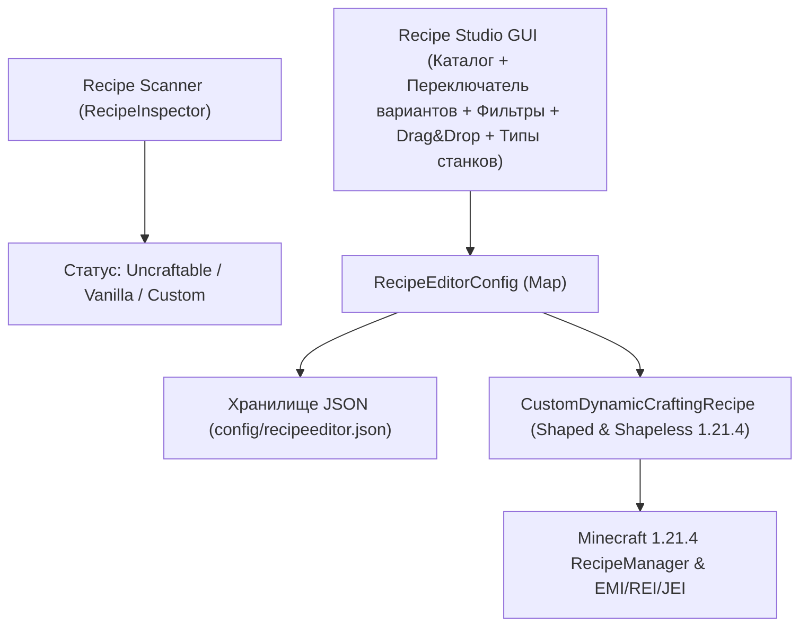

# AGENTS.md — План модернизации мода: Universal Custom Recipe Studio

Данный документ содержит детальную архитектуру, технический дизайн и пошаговый план перехода от специализированного мода (TotemCraft) к универсальной системе создания и редактирования рецептов для **любых предметов** (ванильных и модовых, включая предметы без существующих крафтов).

---

## 🎯 Цели и видение проекта

1. **Универсальность:** Возможность создать или изменить рецепт для абсолютно любого предмета из Minecraft и любых установленных модов.
2. **Чистый старт:** Мод не добавляет никаких встроенных крафтов по умолчанию. База рецептов изначально пуста, а сетка при входе чиста.
3. **Автоматическое определение (Auto-Detection):** Определение статуса предмета на лету через `RecipeManager`:
   - 🔴 **Uncraftable:** Предмет не имеет рецептов в игре (Тотем, Элитры, Седло, Яйцо дракона, модовые реликвии).
   - 🟡 **Vanilla / Modded:** Предмет имеет стандартный рецепт (с возможностью загрузить его в редактор и изменить).
   - 🟢 **Custom:** Рецепт уже создан или переопределен через мод.
4. **Визуальный GUI Редактор:** Удобный графический интерфейс с поддержкой Drag & Drop, поиском, фильтрами, списком «Мои крафты» и предпросмотром.
5. **Разнообразие типов крафта:** Поддержка верстака (Shaped, Shapeless), печей (Smelting) и камнереза.
6. **Динамическая регистрация рецептов:** Прямая инжекция рецептов в игровой движок Minecraft 1.21.4 (Shaped, Shapeless, Furnace, Stonecutter) без необходимости генерации датапаков.
7. **Поддержка множественных вариантов крафта:** Полная поддержка хранения и переключения между несколькими рецептами одного и того же предмета.

---

## 🏗 Архитектура мода

---

## 📋 Пошаговый план разработки (Этапы)

### 🔹 Фаза 1: Рефакторинг структуры данных и хранилища (Data & Config Model)
* [x] **1.1. Класс `CustomRecipeData`:**
  * Поля: `id`, `resultItemId`, `resultCount`, `type`, `patternSlots`, `experience`, `cookingTime`, `enabled`, `overrideExisting`.
  * Уникальные составные ключи рецептов (`resultItemId#type#signature`) и кэширование `Ingredient`.
* [x] **1.2. Менеджер конфигурации `RecipeEditorConfig`:**
  * Хранение словаря вариантов `Map<String, CustomRecipeData>`.
  * Чистый старт без навязанных рецептов по умолчанию.
  * Методы: `addOrUpdateRecipe()`, `getRecipesFor()`, `removeRecipe()`, `save()`, `load()`.

---

### 🔹 Фаза 2: Автосканер и инспектор рецептов (Recipe Scanner)
* [x] **2.1. Сервис `RecipeInspector`:**
  * Сканирование глобального `ServerRecipeManager`, `ClientRecipeBook` и JAR-файлов модов.
  * 4-уровневый `TagResolver` (Реестры мира, JAR датапаки, статический словарь, эвристики).
  * Поддержка декомпиляции кузнечных рецептов незерита (`SmithingTransformRecipe`).
* [x] **2.2. Механизм декомпиляции вариантов рецептов (`getAllRecipeVariants`):**
  * Извлечение всех доступных вариантов крафта для любого предмета в навигационную панель вариантов `[ ◀ ] [ N ] [ ▶ / + ]`.

---

### 🔹 Фаза 3: Модернизация интерфейса (Modern Recipe Studio GUI)
* [x] **3.1. Панель фильтров каталога:**
  * Кнопки быстрых фильтров: `[Все]`, `[Без крафта]`, `[Кастомные]`, `[С крафтом]`.
  * Поиск по ID, локализованному имени и тегам.
* [x] **3.2. Верхняя панель выбора типа станка:**
  * Переключатель типов: `[Верстак 3x3]`, `[Без формы]`, `[Печь]`, `[Плавильня]`, `[Коптильня]`, `[Камнерез]`.
* [x] **3.3. Расширенная сетка крафта с Drag & Drop:**
  * Перетаскивание предметов прямо в слоты сетки и результата.
  * Подсветка зоны сброса и выбранного слота.
  * Панель переключения вариантов рецепта над сеткой крафта.
* [x] **3.4. Очистка и удаление:**
  * Модальное подтверждение очистки всех крафтов `ConfirmScreen`.
  * Кнопки действий смещены в правый нижний угол.

---

### 🔹 Фаза 4: Динамический движок рецептов (Dynamic Recipe Injector)
* [x] **4.1. Универсальный кастомный класс рецептов:**
  * `CustomDynamicCraftingRecipe` (Shaped и Shapeless) с поддержкой сопоставления (`matches`), создания предметов (`craft`) и отображения (`getDisplays`).
  * Сортировка по специфичности для Shapeless крафтов.

---

## 📌 Чеклист для AI-агентов и разработчиков

| Задача | Статус | Примечания |
|---|---|---|
| Поддержка Drag & Drop в GUI | ✅ Завершено | Реализовано в `RecipeEditorScreen` |
| Создание модели данных `CustomRecipeData` | ✅ Завершено | `CustomRecipeData.java`, `RecipeTypeEnum.java` (лимит до 1000, составные ключи, lazy кэш) |
| Множественные варианты крафта одного предмета | ✅ Завершено | Хранение нескольких рецептов на предмет (`RecipeEditorConfig`, `getAllRecipeVariants`) |
| Создание менеджера конфигурации | ✅ Завершено | `RecipeEditorConfig.java` (чистый старт) |
| Декомпиляция незеритовых кузнечных крафтов | ✅ Завершено | `RecipeInspector` сканирует `SmithingTransformRecipe` / `SmithingRecipeDisplay` |
| Реализация `RecipeInspector` (автоопределение статуса) | ✅ Завершено | Прямой скан JAR-файлов модов + ванильный датапак + рантайм сервер/книга |
| Загрузка рецепта по ПКМ в каталоге | ✅ Завершено | Клик ПКМ по любому предмету загружает все его варианты в навигатор |
| Навигатор вариантов рецептов `[ ◀ ] [ N ] [ ▶ / + ]` | ✅ Завершено | Расположен над сеткой крафта, переключает и добавляет новые варианты |
| Разделение станков (Верстак, Без формы, Печь, Плавильня, Коптильня, Камнерез) | ✅ Завершено | 2 колонки кнопок, выровненные по ширине |
| Кнопка «Сохранить крафт» (зеленая) | ✅ Завершено | Сохранение только по явной кнопке, без автосохранения на выход |
| Добавление фильтра «Без крафта (Uncraftable)» в GUI | ✅ Завершено | Автосброс на [Все] при клике на фильтр |
| Динамическое поле ввода количества (до 1000) | ✅ Завершено | Отцентровано относительно слота результата |
| Очистка слотов по клавишам Delete / Backspace | ✅ Завершено | Очистка по горячим клавишам |
| Кнопка статуса «Мои крафты: ВКЛЮЧЕНЫ / ВЫКЛЮЧЕНЫ» | ✅ Завершено | Переключатель состояния мода |
| Чекбоксы «Создать как новый крафт» / «Заменить существующий крафт» | ✅ Завершено | Радио-кнопки (взаимоисключающие чекбоксы) |
| Подтверждение при очистке всех крафтов | ✅ Завершено | Модальное окно `ConfirmScreen` |
| 4-уровневый `TagResolver` (#tag) при загрузке рецептов | ✅ Завершено | Корректное разрешение тегов с fallback реестрами |
| Независимый скролл колесиком мыши | ✅ Завершено | Вкладки модов и сетка каталога скроллятся отдельно при наведении курсора |
| Выравнивание нижних кнопок | ✅ Завершено | Кнопки смещены в правый нижний угол, статус уведомлений слева |
