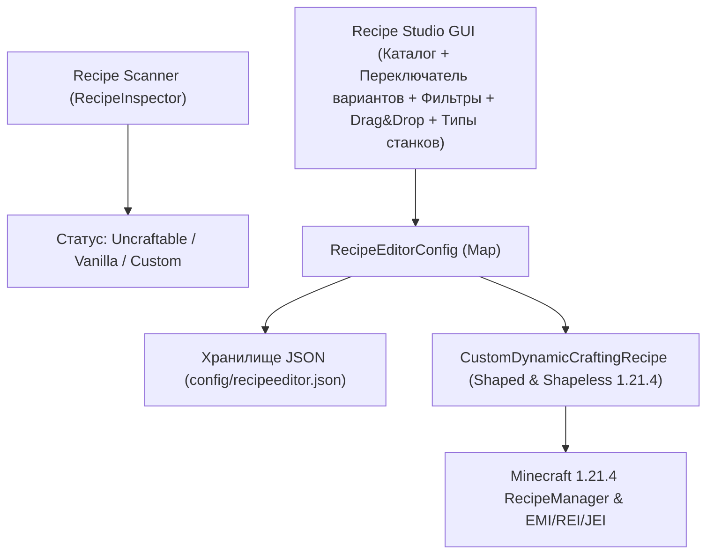

# AGENTS.md — План модернизации мода: Recipe Editor

Данный документ содержит детальную архитектуру, технический дизайн и пошаговый план перехода от изначальной идеи только крафта тотема (TotemCraft) к универсальной системе создания и редактирования рецептов для **любых предметов** (ванильных и модовых, включая предметы без существующих крафтов).

---

## 🎯 Цели и видение проекта

1. **Универсальность:** Возможность создать или изменить рецепт для абсолютно любого предмета из Minecraft и любых установленных модов.
2. **Чистый старт:** Мод не добавляет никаких встроенных крафтов по умолчанию. База рецептов изначально пуста, а сетка при входе чиста.
3. **Автоматическое определение (Auto-Detection):** Определение статуса предмета на лету через `RecipeManager`:
   - 🔴 **Uncraftable:** Предмет не имеет рецептов в игре (Тотем, Элитры, Седло, Яйцо дракона, модовые реликвии).
   - 🟡 **Vanilla / Modded:** Предмет имеет стандартный рецепт (с возможностью загрузить его в редактор и изменить).
   - 🟢 **Custom:** Рецепт уже создан или переопределен через мод.
4. **Визуальный GUI Редактор:** Удобный графический интерфейс с поддержкой Drag & Drop, поиском, фильтрами, списком «Мои крафты» и предпросмотром.
5. **Разнообразие типов крафта:** Поддержка верстака (Shaped, Shapeless), печей (Smelting) и камнереза.
6. **Динамическая регистрация рецептов:** Прямая инжекция рецептов в игровой движок Minecraft 1.21.4 (Shaped, Shapeless, Furnace, Stonecutter) без необходимости генерации датапаков.
7. **Поддержка множественных вариантов крафта:** Полная поддержка хранения и переключения между несколькими рецептами одного и того же предмета.

---

## 🏗 Архитектура мода



---

## 📋 Пошаговый план разработки (Этапы)

### 🔹 Фаза 1: Рефакторинг структуры данных и хранилища (Data & Config Model)
* [x] **1.1. Класс `CustomRecipeData`:**
  * Поля: `id`, `resultItemId`, `resultCount`, `type`, `patternSlots`, `experience`, `cookingTime`, `enabled`, `overrideExisting`.
  * Уникальные составные ключи рецептов (`resultItemId#type#signature`) и кэширование `Ingredient`.
* [x] **1.2. Менеджер конфигурации `RecipeEditorConfig`:**
  * Хранение словаря вариантов `Map<String, CustomRecipeData>`.
  * Чистый старт без навязанных рецептов по умолчанию.
  * Методы: `addOrUpdateRecipe()`, `getRecipesFor()`, `removeRecipe()`, `save()`, `load()`.

---

### 🔹 Фаза 2: Автосканер и инспектор рецептов (Recipe Scanner)
* [x] **2.1. Сервис `RecipeInspector`:**
  * Сканирование глобального `ServerRecipeManager`, `ClientRecipeBook` и JAR-файлов модов.
  * 4-уровневый `TagResolver` (Реестры мира, JAR датапаки, статический словарь, эвристики).
  * Поддержка декомпиляции кузнечных рецептов незерита (`SmithingTransformRecipe`).
* [x] **2.2. Механизм декомпиляции вариантов рецептов (`getAllRecipeVariants`):**
  * Извлечение всех доступных вариантов крафта для любого предмета в навигационную панель вариантов `[ ◀ ] [ N ] [ ▶ / + ]`.

---

### 🔹 Фаза 3: Модернизация интерфейса (Modern Recipe Studio GUI)
* [x] **3.1. Панель фильтров каталога:**
  * Кнопки быстрых фильтров: `[Все]`, `[Без крафта]`, `[Кастомные]`, `[С крафтом]`.
  * Поиск по ID, локализованному имени и тегам.
* [x] **3.2. Верхняя панель выбора типа станка:**
  * Переключатель типов: `[Верстак 3x3]`, `[Без формы]`, `[Печь]`, `[Плавильня]`, `[Коптильня]`, `[Камнерез]`.
* [x] **3.3. Расширенная сетка крафта с Drag & Drop:**
  * Перетаскивание предметов прямо в слоты сетки и результата.
  * Подсветка зоны сброса и выбранного слота.
  * Панель переключения вариантов рецепта над сеткой крафта.
* [x] **3.4. Очистка и удаление:**
  * Модальное подтверждение очистки всех крафтов `ConfirmScreen`.
  * Кнопки действий смещены в правый нижний угол.

---

### 🔹 Фаза 4: Динамический движок рецептов (Dynamic Recipe Injector)
* [x] **4.1. Универсальный кастомный класс рецептов:**
  * `CustomDynamicCraftingRecipe` (Shaped и Shapeless) с поддержкой сопоставления (`matches`), создания предметов (`craft`) и отображения (`getDisplays`).
  * Сортировка по специфичности для Shapeless крафтов.

---

### 🔹 Фаза 5: Сетевая синхронизация, книга рецептов 1.21.4 и интеграция с просмотрщиками (Recipe Book & Viewers)
* [x] **5.1. Ванильная книга рецептов Minecraft 1.21.4 (`ServerRecipeBook` & `NetworkRecipeId`):**
  * Пул динамических `NetworkRecipeId` (индексы от `1_000_000+`) в `CustomRecipeDispatcher`.
  * Создание валидных `RecipeDisplayEntry` с корректными категориями (`EQUIPMENT`, `BUILDING`, `REDSTONE`, `MISC`), верстаками и требованиями ингредиентов (`craftingRequirements`).
  * Инжекция в `ServerRecipeBook.isUnlocked` для мгновенного доступа к автокрафту и блокировки переопределённых оригиналов.
  * Инжекция в `ServerRecipeBook.sendInitRecipesPacket` и рассылка пакетов `RecipeBookAddS2CPacket` / `RecipeBookRemoveS2CPacket` при подключении и изменениях на лету.
  * Перехват `ServerRecipeManager.get(NetworkRecipeId)` для штатной работы автозаполнения сетки при клике по рецепту (`CraftRequestC2SPacket`).
* [x] **5.2. Интеграция с модами просмотра крафтов (REI / EMI):**
  * Протестирована и верифицирована интеграция с Roughly Enough Items (REI): динамический перезапуск реестров и скрытие переопределённых крафтов.
  * Реализована тестовая поддержка перезагрузки для EMI через `RecipeViewerIntegration`.
  * Перехват `getStonecutterRecipes` и `getStonecutterRecipeForSync` в `ServerRecipeManagerMixin` для камнереза.
* [x] **5.3. Изоляция серверного окружения (Dedicated Server Safety):**
  * Полное разделение серверных миксинов и клиентских классов GUI/инспектора.
  * Замена кэширования `hashCode()` на отслеживание монотонного `configVersion`.

---

## 📌 Чеклист для AI-агентов и разработчиков

| Задача | Статус | Примечания |
|---|---|---|
| Поддержка Drag & Drop в GUI | ✅ Завершено | Реализовано в `RecipeEditorScreen` |
| Создание модели данных `CustomRecipeData` | ✅ Завершено | `CustomRecipeData.java`, `RecipeTypeEnum.java` (лимит до 1000, составные ключи, lazy кэш) |
| Множественные варианты крафта одного предмета | ✅ Завершено | Хранение нескольких рецептов на предмет (`RecipeEditorConfig`, `getAllRecipeVariants`) |
| Создание менеджера конфигурации | ✅ Завершено | `RecipeEditorConfig.java` (чистый старт) |
| Декомпиляция незеритовых кузнечных крафтов | ✅ Завершено | `RecipeInspector` сканирует `SmithingTransformRecipe` / `SmithingRecipeDisplay` |
| Реализация `RecipeInspector` (автоопределение статуса) | ✅ Завершено | Прямой скан JAR-файлов модов + ванильный датапак + рантайм сервер/книга |
| Загрузка рецепта по ПКМ в каталоге | ✅ Завершено | Клик ПКМ по любому предмету загружает все его варианты в навигатор |
| Навигатор вариантов рецептов `[ ◀ ] [ N ] [ ▶ / + ]` | ✅ Завершено | Расположен над сеткой крафта, переключает и добавляет новые варианты |
| Разделение станков (Верстак, Без формы, Печь, Плавильня, Коптильня, Камнерез) | ✅ Завершено | 2 колонки кнопок, выровненные по ширине |
| Кнопка «Сохранить крафт» (зеленая) | ✅ Завершено | Сохранение только по явной кнопке, без автосохранения на выход |
| Добавление фильтра «Без крафта (Uncraftable)» в GUI | ✅ Завершено | Автосброс на [Все] при клике на фильтр |
| Динамическое поле ввода количества (до 1000) | ✅ Завершено | Отцентровано относительно слота результата |
| Очистка слотов по клавишам Delete / Backspace | ✅ Завершено | Очистка по горячим клавишам |
| Кнопка статуса «Мои крафты: ВКЛЮЧЕНЫ / ВЫКЛЮЧЕНЫ» | ✅ Завершено | Переключатель состояния мода |
| Чекбоксы «Создать как новый крафт» / «Заменить существующий крафт» | ✅ Завершено | Радио-кнопки (взаимоисключающие чекбоксы) |
| Подтверждение при очистке всех крафтов | ✅ Завершено | Модальное окно `ConfirmScreen` |
| 4-уровневый `TagResolver` (#tag) при загрузке рецептов | ✅ Завершено | Корректное разрешение тегов с fallback реестрами |
| Независимый скролл колесиком мыши | ✅ Завершено | Вкладки модов и сетка каталога скроллятся отдельно при наведении курсора |
| Выравнивание нижних кнопок | ✅ Завершено | Кнопки смещены в правый нижний угол, статус уведомлений слева |
| Алгоритм скользящего окна крафта (dx, dy) | ✅ Завершено | Позволяет крафтить рецепты меньше 3x3 на верстаке в любом положении |
| Защита LAN и проверка прав хоста | ✅ Завершено | Доступ к редактированию ограничен оператором 2-го уровня и хостом LAN |
| Потокобезопасность реестра рецептов | ✅ Завершено | `ConcurrentHashMap` и volatile флаги в `RecipeEditorConfig` |
| Защита от потери предметов при Shift-клике | ✅ Завершено | Ограничение выдачи в `craft()` безопасным лимитом стака предмета |
| Асинхронное фоновое сканирование JAR | ✅ Завершено | Фоновый запуск при старте клиента, индикатор загрузки в GUI |
| Очистка кешей миров при дисконнекте | ✅ Завершено | `ClientPlayConnectionEvents.DISCONNECT` предотвращает утечки памяти |
| Удаление крафтов по ПКМ в «Мои крафты» | ✅ Завершено | Кнопки «Удалить этот вариант крафта» и «Удалить этот крафт» отображаются только при ПКМ по предмету в «Мои крафты» |
| Подчеркивание вкладки «Мои крафты» | ✅ Завершено | Текст вкладки подчеркивается, если в конфигурации есть хотя бы один кастомный крафт |
| Устранение stale-null кеша тегов | ✅ Завершено | Повторный расчет тегов при их регистрации и инвалидация на JOIN |
| Синтетические shaped рецепты в `values()` | ✅ Завершено | Поддержка `SHAPED_CRAFTING` в `createSyntheticRecipe` для EMI/JEI/REI |
| Очистка `TAG_ITEMS` в `TagResolver` | ✅ Завершено | Предотвращение утечек данных и памяти между мирами |
| Скрытие виджетов при отключении мода | ✅ Завершено | Виджеты левой панели скрываются при `modEnabled == false` |
| Настройка времени плавки и опыта в GUI | ✅ Завершено | Поля ввода времени (тики) и опыта (XP) для печей |
| Высокий приоритет миксина (500) | ✅ Завершено | Совместимость с оптимизаторами FastSuite / Recipe Essentials |
| Интеграция с ванильной книгой рецептов верстака (1.21.4) | ✅ Завершено | Реализовано через `ServerRecipeBookMixin` и `ServerRecipeManagerMixin` |
| Поддержка `NetworkRecipeId` и `RecipeDisplayEntry` | ✅ Завершено | Генерация пула индексов `1_000_000+` в `CustomRecipeDispatcher` |
| Автозаполнение сетки при клике в книге (`CraftRequestC2SPacket`) | ✅ Завершено | Перехват `ServerRecipeManager.get(NetworkRecipeId)` и `isUnlocked()` |
| Протестированная интеграция с REI | ✅ Завершено | Скрытие переопределений и регистрация синтетических записей |
| Тестовая поддержка перезагрузки EMI | ✅ Завершено | Интеграция через `RecipeViewerIntegration.java` |
| Синхронизация рецептов камнереза | ✅ Завершено | Миксины `getStonecutterRecipes` и `getStonecutterRecipeForSync` |
| Безопасность выделенного сервера (Dedicated Server) | ✅ Завершено | Изоляция клиентских классов от общих сетевых и серверных миксинов |
| Переход от `hashCode()` к `configVersion` | ✅ Завершено | Надежная инвалидация кэшей при изменениях конфигурации |


---

## 📝 Стандарты оформления коммитов (Commit Message Guidelines)

1. **Заголовок (Title):**
   * Краткое и емкое описание изменений на английском языке в повелительном наклонении (`Fix ...`, `Add ...`, `Refactor ...`, `Update ...`).
   * Без точки на конце строки.
   * Длина строки заголовка предпочтительно до 72 символов.

2. **Пустая строка** между заголовком и подробным описанием.

3. **Тело коммита (Body):**
   * Маркированный список конкретных изменений (`- <Компонент/Класс/Файл>: <описание сути изменения>`).
   * Четкое техническое объяснение: что именно исправлено, оптимизировано или добавлено.

**Пример структуры:**
```
Fix shaped recipe sliding matching, LAN permissions, and GUI freeze

- CustomDynamicCraftingRecipe: implement sliding window (dx, dy) matching for recipes smaller than 3x3
- RecipeEditorMod: verify integrated server host to prevent unauthorized LAN changes
- RecipeInspector: scan mod JARs asynchronously on startup to eliminate screen freeze
```

---

## 📖 Стандарты составления README (Player-Friendly Documentation)

Файлы `README.md` и `readme.en.md` предназначены для **обычных игроков**, а не разработчиков.
* **Никакого кода и внутреннего сленга:** избегать упоминания имён Java-классов (`CustomDynamicCraftingRecipe`, `ConcurrentHashMap`), низкоуровневых методов (`Ingredient.test()`, `Files.walk()`), сетевых пакетов (`UpdateRecipeC2SPacket`) и технических терминов (`декомпиляция`, `инжекция миксинов`).
* **Фокус на игровом опыте:** описывать, что игрок видит, нажимает и получает в игре («перетаскивайте предметы мышкой», «создавайте свои рецепты для любых верстаков и печей», «работает на серверах и в локальной сети», «защита от случайных конфликтов»).
* **Понятные аналогии:** вместо «декомпиляция рецепта» — «просмотр и загрузка готового крафта по правому клику мыши»; вместо «скользящее окно 3x3» — «маленькие крафты 2x2 и 1x2 работают в любой части верстака».
* **Без разделителей (`---`):** категорически **не добавлять** горизонтальные линии-разделители `---` между секциями и заголовками в файлах `README.md` и `readme.en.md`. Документ должен быть чистым, с разделением блоков только заголовками и стандартными отступами.


