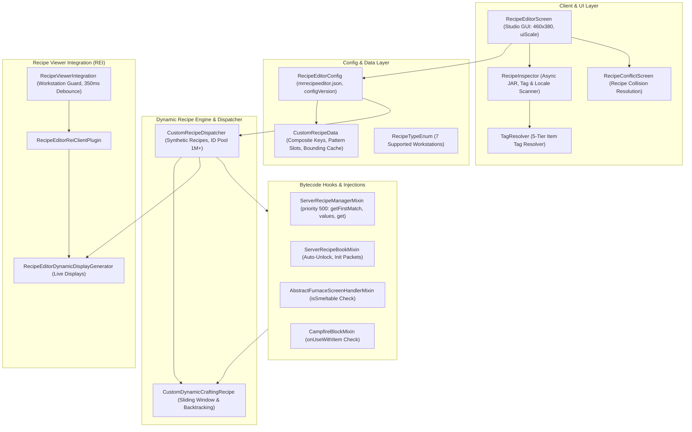

# Architectural Blueprint and Technical Specification for [MR] Recipe Editor (Minecraft 26.1 Fabric)

This document provides a comprehensive technical blueprint and architectural specification for the **[MR] Recipe Editor** modification for Minecraft 26.1 (Fabric). It is designed for AI agents, system architects, and software engineers who require an exhaustive understanding of every implementation detail: from internal data structures and pattern-matching algorithms to network synchronization, Roughly Enough Items (REI) integration, and low-level bytecode mixins.

---

## 1. Concept, Environment, and Philosophy

### 1.1. Core Objective
Provide players and local server administrators with a universal, in-game utility to view, create, modify, and delete recipes for any item (vanilla Minecraft items as well as items from any installed modifications) live in-game through an interactive graphical interface, eliminating the need for manual datapack creation or client restarts.

### 1.2. "Clean Slate" Philosophy
The mod fundamentally **does not bundle or inject** any preconfigured custom recipes by default:
* On first launch, the custom recipe registry is completely empty (`recipes.isEmpty()`).
* When opening the editor GUI, the crafting grid is blank; no recipe is imposed on the user.
* All vanilla and modded mechanics remain completely untouched until the user explicitly saves a new custom recipe or overrides an existing one.

### 1.3. Target Platform and Dependencies
* **Minecraft:** 26.1.
* **Java:** 25.
* **Fabric Loader:** `>= 0.16.0`.
* **Fabric API:** `0.145.1+26.1`.
* **Fabric Loom:** `1.18-SNAPSHOT`.
* **Mod Menu:** Declared in `modmenu` entrypoint and strictly required in `depends` (`"modmenu": "*"`) within `fabric.mod.json`.
* **Roughly Enough Items (REI):** `18.0.815` (declared dependency in `suggests`, official API integration).
* **Execution Environment:** Client and Integrated Server (Singleplayer / LAN).
* **Dedicated Server Safety:** A dedicated server environment is detected via `FabricLoader.getInstance().getEnvironmentType() == EnvType.SERVER`. When running on a dedicated server, the mod logs an informative console banner and gracefully disables all runtime features without crashing or interfering with server startup.

### 1.4. Build Instructions and Key Version Nuances for Minecraft 26.1
1. **Prerequisites & Build Command**:
   * JDK 25 (`C:\Program Files\Java\jdk-25.0.2` configured in `gradle.properties`).
   * `./gradlew clean build --console=plain`
   * Remapped production JAR: `build/libs/MrRecipeEditor-Fabric-26.1-byMr712-v1.4.jar`.
2. **Key Version Specific Nuances (Minecraft 26.X & 26.1)**:
   * **Official Mojang Mappings & Java 25**:
     Modern Mojang mapping nomenclature (`net.minecraft.world.item.*`, `net.minecraft.client.gui.screens.*`, `net.minecraft.core.registries.BuiltInRegistries`).
   * **Main Menu / Title Screen Item Component Initialization Guard (`ensureItemComponentsBound` & `safeProvider`)**:
     In Minecraft 26.X, item data components (`DataComponentMap`) must be built through `BuiltInRegistries.DATA_COMPONENT_INITIALIZERS.build(provider)` before instantiating `ItemStack` or displaying items when opening the editor GUI from ModMenu on the title screen.
     Dynamic world datapack registries (`RegistryAccess`) do not exist yet on the title screen. Vanilla component initializers for items like fire-resistant armor or trimmed gear attempt to resolve dynamic datapack entries (e.g., `DamageTypes.IS_FIRE`, `TrimMaterials.REDSTONE`). Calling `build()` directly throws `IllegalStateException: Missing tag` or `Missing element`.
     **Solution:** `RecipeInspector.ensureItemComponentsBound()` constructs a fallback `safeProvider` wrapping `BuiltInRegistries.createWrapperLookup()`. The provider intercepts lookup calls and returns empty tag sets (`HolderSet.emptyNamed(...)`), standalone reference fallbacks (`Holder.Reference.createStandAlone(...)`), and empty registry lookups, allowing all item components to bind safely without crashing on the title screen.
   * **SDL3 / Modern Mojang Input Model (`MouseButtonEvent`, `InputConstants` & `uiScale` Coordinate Translation)**:
     Minecraft 26.X replaces GLFW with SDL3. Under SDL3, mouse button indices are 1-based:
     - `InputConstants.MOUSE_BUTTON_LEFT` is `1` (Left Click).
     - `InputConstants.MOUSE_BUTTON_MIDDLE` is `2` (Middle Click).
     - `InputConstants.MOUSE_BUTTON_RIGHT` is `3` (Right Click).
     (In GLFW / 1.21, left was 0 and right was 1. In 26.X, checking `button == 1` for right-click caused left-click to trigger right-click actions and completely ignored true right-clicks with button 3).
     All mouse handlers use `isLeftClick(button)` and `isRightClick(button)` checking `InputConstants.MOUSE_BUTTON_LEFT` and `InputConstants.MOUSE_BUTTON_RIGHT`.
     Drag-and-drop item movement, right-click catalog recipe loading (`isRightClick`), right-click slot clearing, and text field drag-selection via `SelectableTextFieldWidget` operate seamlessly with precision coordinates.
   * **Screen Navigation**:
     Screen transitions in 26.1 utilize `minecraft.setScreen(...)`.
   * **Recipe Book & Network Architecture (`ServerRecipeManager`, `NetworkRecipeId`, `RecipeDisplay`)**:
     Recipes in 26.X are managed via `ServerRecipeManager` (split from the unified 1.21 `RecipeManager`), with display sync driven by `RecipeDisplayEntry` and dynamic `NetworkRecipeId` pools ($1\,000\,000+$) preventing ID collisions with vanilla recipes.

---

## 2. High-Level System Architecture



---

## 3. Data Models and Configuration (`com.recipeeditor.config`)

### 3.1. Supported Workstation Types (`RecipeTypeEnum`)
An enumeration defining 7 workstation categories:
1. `SHAPED_CRAFTING` — Crafting Table (3x3 grid supporting both shaped and shapeless crafts). Translation: `block.minecraft.crafting_table`.
2. `SMITHING` — Smithing Table (gear upgrade via 3 slots: template, base, addition). Translation: `block.minecraft.smithing_table`.
3. `SMELTING` — Regular Furnace (resource & food smelting, 1 input slot, cook time and XP). Translation: `block.minecraft.furnace`.
4. `BLASTING` — Blast Furnace (rapid ore and metal smelting, 1 input slot). Translation: `block.minecraft.blast_furnace`.
5. `SMOKING` — Smoker (rapid food cooking, 1 input slot). Translation: `block.minecraft.smoker`.
6. `STONECUTTING` — Stonecutter (stone and block precision carving, 1 input slot). Translation: `block.minecraft.stonecutter`.
7. `CAMPFIRE_COOKING` — Campfire (open-flame fuel-less cooking, 1 input slot). Translation: `block.minecraft.campfire`.

Methods `fromRecipeType(RecipeType<?>)` and `toRecipeType()` provide bidirectional mapping between mod enums and vanilla registry types.

### 3.2. Recipe Data Model (`CustomRecipeData`)
The core serializable recipe model:
* `id` (`String`): System identifier for the craft.
* `resultItemId` (`String`): Identifier of the output item (e.g., `minecraft:totem_of_undying`).
* `resultCount` (`int`): Quantity of output items (clamped between 1 and 1000).
* `type` (`RecipeTypeEnum`): Target workstation type.
* `patternSlots` (`String[9]`): Array of 9 strings representing grid ingredients. Empty slots contain `"minecraft:air"`. Supports both item identifiers (`minecraft:iron_ingot`) and tag keys (`#minecraft:planks`, `#c:iron_ingots`).
  * 1-slot workstations (Furnace, Blast Furnace, Smoker, Stonecutter, Campfire) use only `patternSlots[0]`.
  * Smithing Table uses: `patternSlots[0]` (template), `patternSlots[1]` (base), `patternSlots[2]` (addition).
  * Crafting Table uses all 9 slots (row-major order from top-left to bottom-right).
* `experience` (`float`): Experience points rewarded upon cooking.
* `cookingTime` (`int`): Cooking duration in game ticks (20 ticks = 1 second).
* `enabled` (`boolean`): Active state of the recipe.
* `overrideExisting` (`boolean`): Flag to suppress an existing vanilla or modded recipe with identical pattern or identifier.
* `overriddenId` (`String`): Identifier of the overridden recipe.
* `overriddenKey` (`String`): Signature key of the overridden recipe.
* `isShapeless` (`boolean`): Indicates shapeless crafting behavior on the crafting table.
* `typeCounts` (`Map<String, Integer>`): Remembers output item counts individually per workstation type when switching tabs in the GUI.

#### Composite Keys and Signatures:
* `getPatternSignature()`: Returns a comma-separated string of all 9 slots (`"slot0,slot1,...,slot8"`).
* `getKey()`: Computes a unique compound key:
  `resultItemId + "#" + type.name() + (isShapeless ? "#SL#" : "#") + getPatternSignature()`.
  This allows multiple recipe variants for the same item to coexist without collisions.

#### Bounding Box Calculation (`computePatternBounds`):
Calculates the minimal bounding coordinates (`minRow`, `minCol`, `maxRow`, `maxCol`), determining `patternWidth` and `patternHeight`. Computed dimensions are cached and invalidated via `invalidateCache()` whenever grid contents change.

#### Safe Tag Ingredient Resolution:
Method `computeIngredientForSlot(int slot)` queries `TagKey` from `Registries.ITEM`. **Critical Design Safeguard:** If a tag is not yet present in the registry (e.g., world not loaded yet or mod removed), it returns `Ingredient.ofItems()` (an unmatchable empty ingredient), **never `null`**! Returning `null` would cause the engine to interpret the missing tag as `AIR`, resulting in accidental crafts triggering on empty crafting table slots.

### 3.3. Configuration Management (`RecipeEditorConfig`)
* **Thread Safety:** Recipes are stored in a `ConcurrentHashMap<String, CustomRecipeData> recipes`.
* **$O(1)$ Fast Check Cache:** `Set<String> enabledResultIds = ConcurrentHashMap.newKeySet()` enables instantaneous existence checks in `hasCustomRecipe(String itemId)`.
* **Monotonic Version Counter (`configVersion`):** Rather than relying on fragile hash codes, every mutation (`save()`, `addOrUpdateRecipe()`, `removeRecipe()`) increments `configVersion++`. All mixins, caches, and displays check this counter to determine staleness.
* **Atomic File Persistence (`save()`):**
  1. Serializes formatted JSON via Gson into a temporary file `config/mrrecipeeditor.json.tmp`.
  2. Executes an atomic file move `Files.move(tmpPath, configPath, ATOMIC_MOVE, REPLACE_EXISTING)`.
  3. Catches `AtomicMoveNotSupportedException` with a graceful fallback to standard replacement.
  4. Automatic migration: if legacy `config/recipeeditor.json` exists while `mrrecipeeditor.json` does not, it is automatically migrated.
* **Crafting Recipe Sorting (`getSortedCraftingRecipes()`):**
  Crafting table recipes are cached in deterministic order with the following precedence:
  1. Shaped recipes are evaluated **before** shapeless recipes.
  2. Among shapeless recipes, those with **more non-empty ingredients** are evaluated first (prevents a 2-ingredient recipe from preempting a 4-ingredient recipe).
  3. Tied recipes are ordered lexicographically by `getKey()`.

---

## 4. Dynamic Recipe Engine (`com.recipeeditor.recipe`)

### 4.1. Universal Crafting Recipe (`CustomDynamicCraftingRecipe`)
Inherits from vanilla `ShapedRecipe`, registers under serializer `custom_crafting` in `Registries.RECIPE_SERIALIZER`, and overrides matching routines:

#### Sliding Window Algorithm (`matchesShaped`):
Enables patterns smaller than $3 \times 3$ (e.g., $2 \times 2$ or $1 \times 2$) to match anywhere inside the 3x3 crafting grid:
1. Resolves `patternW` and `patternH`.
2. Returns `false` if grid dimensions `inputW` or `inputH` are smaller than pattern dimensions.
3. Iterates displacement offsets `dx` ($0 \dots \text{inputW} - \text{patternW}$) and `dy` ($0 \dots \text{inputH} - \text{patternH}$).
4. Tests both direct orientation and **horizontally mirrored** orientation (`mirrored = true`).
5. In `checkMatchAt`:
   * Cells inside the pattern window must satisfy `expectedIngredient.test(actualStack)`.
   * All grid cells **outside** the pattern window must be strictly empty (`actual.isEmpty()`).

#### Recursive Backtracking for Shapeless Crafts (`matchesShapeless`):
1. Verifies that the count of non-empty items in the grid exactly equals the required ingredient count.
2. `matchShapelessBacktrack` performs recursive bipartite matching using a boolean array `usedIngs`, resolving complex ingredient permutations without allocating extra collections.

#### Memoized Input Caching:
Method `findMatchingRecipe` memoizes `lastInput`, `lastMatchedRecipe`, and `lastInputConfigVersion`. If the player has not changed grid contents, expensive iterations across hundreds of recipes are bypassed, returning results in $O(1)$.

#### Shift-Click Stack Loss Protection (`craft()`):
In `craft()`, the output stack size is clamped to the item's maximum stack size:
```java
int safeCount = Math.min(resultItem.getMaxCount(), Math.max(1, matched.getResultCountForType(matched.type)));
return new ItemStack(resultItem, safeCount);
```
This prevents item deletion bugs when shift-clicking outputs, even if configured up to 1000 items in the GUI.

### 4.2. Central Recipe Dispatcher (`CustomRecipeDispatcher`)
Bridges all 7 workstation types, generates synthetic vanilla recipe instances, and synchronizes the Minecraft 1.21.4 recipe book.

#### Synthetic Recipe Factory (`createSyntheticRecipe`):
Constructs real vanilla recipe instances dynamically:
* `ShapedRecipe` / `ShapelessRecipe` (Crafting Table).
* `SmeltingRecipe` (Furnace).
* `BlastingRecipe` (Blast Furnace).
* `SmokingRecipe` (Smoker).
* `CampfireCookingRecipe` (Campfire).
* `StonecuttingRecipe` (Stonecutter).
* `SmithingTransformRecipe` (Smithing Table).

#### Category Heuristics:
Enables correct tab organization inside the vanilla recipe book:
* `getCraftingCategory(Item)`: classifies weapons, tools, armor, bows, shields, maces as `EQUIPMENT`; redstone blocks, hoppers, droppers, pistons, crafters as `REDSTONE`; blocks as `BUILDING`; other items as `MISC`.
* `getCookingCategory(Item)`: classifies food items as `FOOD`, blocks as `BLOCKS`, other items as `MISC`.

#### Recipe Overrides Mechanism:
Methods `isRecipeOverridden(RecipeEntry<?>)`, `isIdentifierOverridden(Identifier)`, and `isIdOverridden(String)` use cached sets `cachedOverriddenIds` and `cachedOverriddenIdentifiers`. They check exact datapack IDs (`minecraft:iron_sword`), short path names (`iron_sword`), and signatures, suppressing vanilla/modded crafts when marked as overridden in the editor.

---

## 5. Minecraft 1.21.4 Recipe Book and Network Synchronization

In Minecraft 1.21.4, recipe identification is powered by `NetworkRecipeId`, with visual rendering governed by `RecipeDisplayEntry` and `RecipeDisplay`.

### 5.1. Dynamic Network ID Pool (`NetworkRecipeId`)
To prevent conflicts with vanilla recipes (which occupy lower indices $0 \dots 999\,999$), the dispatcher allocates an isolated range starting at 1,000,000:
```java
public static int getBaseNetworkId(String recipeKey) {
    if (recipeKey == null) return 1_000_000;
    return 1_000_000 + ((recipeKey.hashCode() & 0x7FFFFFFF) % 80_000_000) * 10;
}
```
Each recipe display receives a unique `NetworkRecipeId(baseNetId + d)`.

### 5.2. Network Synchronization Packets
* **Player Connection (`ServerPlayConnectionEvents.JOIN`):**
  Sends `RecipeBookAddS2CPacket` containing all custom `RecipeDisplayEntry` records to joining players.
* **On-the-Fly Sync (`syncRecipeBookToPlayers`):**
  Computes the delta between `PREVIOUS_NETWORK_IDS` and current IDs:
  1. Broadcasts `RecipeBookRemoveS2CPacket(oldIds)` for deleted recipes.
  2. Broadcasts `RecipeBookAddS2CPacket(entries, false)` for added recipes.
  3. Client recipe books update instantly without reconnecting.

### 5.3. Recipe Book Auto-Fill (`CraftRequestC2SPacket`)
When clicking a custom recipe in the recipe book, the client transmits a `CraftRequestC2SPacket` containing the `NetworkRecipeId`. `ServerRecipeManagerMixin` intercepts `ServerRecipeManager.get(NetworkRecipeId)` and returns the associated `ServerRecipe`, allowing vanilla crafting table auto-fill logic to distribute items cleanly across the grid.

---

## 6. Bytecode Injection Pipeline (`com.recipeeditor.mixin`)

Mixins operate with elevated priority (`priority = 500`), guaranteeing clean coexistence with recipe optimizers such as FastSuite or Recipe Essentials.

### 6.1. `ServerRecipeManagerMixin`
Core interception point for server-side recipe resolution:
1. `@Inject getFirstMatch` (all three overloads):
   * `HEAD`: Queries `CustomRecipeDispatcher`. If a match is found, immediately returns it.
   * `RETURN`: If a vanilla recipe matched but is marked as overridden (`isRecipeOverridden`), replaces return value with `Optional.empty()`.
2. `@Inject getStonecutterRecipes` and `getStonecutterRecipeForSync`:
   * Combines custom stonecutter grouping entries with vanilla groupings, excluding overridden entries.
3. `@Inject values()`:
   * Filters out overridden entries and appends all synthetic custom recipes.
4. `@Inject get(RegistryKey)`:
   * Resolves synthetic custom recipe entries when queried by key.
5. `@Inject get(NetworkRecipeId)`:
   * For IDs $\ge 1\,000\,000$, returns custom `ServerRecipe` to facilitate recipe book auto-filling.
6. `@Inject forEachRecipeDisplay`:
   * Dispatches displays for `recipeeditor` recipes while suppressing overridden entries.

### 6.2. `ServerRecipeBookMixin`
* `@Inject isUnlocked`:
  * Returns `true` immediately for any key under namespace `recipeeditor`, bypassing advancement checks.
  * Returns `false` for overridden recipes, hiding them from the book interface.
* `@Inject sendInitRecipesPacket`:
  * Transmits custom displays via `CustomRecipeDispatcher.sendCustomRecipeBookEntries`.

### 6.3. `AbstractFurnaceScreenHandlerMixin`
* `@Inject isSmeltable`:
  * Intercepts item insertion validation for furnaces, smokers, and blast furnaces.
  * Returns `true` if a custom cooking recipe exists for the item.
  * Returns `false` if the vanilla cooking recipe is overridden.

### 6.4. `CampfireBlockMixin`
* `@Inject onUseWithItem`:
  * Intercepts right-clicks on campfires.
  * When a custom campfire recipe matches, places the item onto the campfire block entity on the server or consumes animation on the client.

### 6.5. `TextFieldWidgetAccessor`
Accessor exposing `firstCharacterIndex` from vanilla `TextFieldWidget`, enabling accurate character selection and mouse dragging in text input fields.

---

## 7. Recipe Viewer Integration (Roughly Enough Items / REI)

Integrated via the official REI Fabric API (`com.recipeeditor.integration.rei` and `com.recipeeditor.integration`).

### 7.1. Official Client Plugin (`RecipeEditorReiClientPlugin`)
Implements `REIClientPlugin` with entrypoint `rei_client`:
* Registers `RecipeEditorDynamicDisplayGenerator` as a global dynamic display generator.
* Registers a `DisplayVisibilityPredicate` to hide vanilla or modded displays when overridden by custom editor recipes.

### 7.2. Dynamic Display Generator (`RecipeEditorDynamicDisplayGenerator`)
Implements `DynamicDisplayGenerator<Display>` across three access paths:
1. `getRecipeFor(EntryStack)` — user presses 'R' on an item.
2. `getUsageFor(EntryStack)` — user presses 'U' on an item.
3. `generate(ViewSearchBuilder)` — user browses workstation categories.

Builds native REI displays dynamically:
* `DefaultCustomShapedDisplay` & `DefaultCustomShapelessDisplay` for Crafting Table.
* `DefaultSmeltingDisplay`, `DefaultBlastingDisplay`, `DefaultSmokingDisplay` for Furnaces.
* `DefaultStoneCuttingDisplay` for Stonecutter.
* `DefaultCampfireDisplay` for Campfire.
* `DefaultSmithingDisplay` for Smithing Table.

### 7.3. Workstation Guard & Debounce (`RecipeViewerIntegration`)
* **Workstation Guard:**
  Postpones REI reloads whenever the player has an active container or workstation screen open (`client.currentScreen instanceof HandledScreen`). Prevents screen freezing and desynchronization while crafting.
* **350ms Debounce:**
  Coalesces rapid successive saves into a single scheduled reload in a background thread.
* **Cached MethodHandle:**
  Accesses `DisplayRegistry.getDisplayOrigin` using a cached `MethodHandle`, eliminating Java Reflection overhead during high-frequency frame filtering.

---

## 8. Inspection, Decompilation, and Tag Resolution (`com.recipeeditor.inspector`)

### 8.1. 5-Tier Tag Resolver (`TagResolver`)
Resolves item tag keys (`#minecraft:planks`, `#c:iron_ingots`) to concrete `Item` instances across all environments:
1. **Tier 1 (World Registry):** Client world dynamic `RegistryManager`.
2. **Tier 2 (Static Registry):** `Registries.ITEM.iterateEntries(tagKey)`.
3. **Tier 3 (Scanned Mod JSON):** Parsed `TAG_ITEMS` map collected from scanned mod JARs (`data/<ns>/tags/item/*.json`).
4. **Tier 4 (Static Fallback Dictionary):** Built-in dictionary covering common vanilla and Conventional Fabric tags (planks, ingots, rods, wool, ores, dyes, glass).
5. **Tier 5 (Heuristic Keyword Matching):** Substring analysis (`plank` $\to$ oak planks, `stone` $\to$ stone, `ingot` $\to$ iron ingot, etc.).

### 8.2. Recipe Inspector (`RecipeInspector`)
* **Async Startup JAR Scanning (`startJarScanAsync`):**
  Scans all installed mods (`FabricLoader.getAllMods()`) in a background daemon thread, extracting recipes and tags without blocking the game loading screen.
* **Synthetic Decompilation of Hardcoded Vanilla Recipes:**
  Automatically reconstructs dynamic vanilla recipes that lack static JSON definitions:
  * Netherite smithing upgrades (all 9 armor and tool pieces) $\to$ template + diamond item + netherite ingot.
  * Bundle re-dyeing (all 16 colors).
  * Cross-dyeing of wool, beds, candles, shulker boxes, and carpets.
* **Multilingual Search and Keyboard Layout Correction:**
  * Indexes locale files from mod JARs and launcher asset caches (`.minecraft/assets/indexes/*.json`, `ru_ru.json`, `uk_ua.json`). Searching in Russian ("железо", "палка") finds items even if the client language is English.
  * `flipKeyboardLayout` transparently swaps mismatched keyboard layouts (QWERTY $\leftrightarrow$ ЙЦУКЕН), resolving unintended queries like "njntv" $\to$ "тотем".

---

## 9. Recipe Conflict Resolution (`RecipeConflictScreen`)

When saving a recipe, `RecipeInspector.findConflicts` validates uniqueness:
* Checks custom, vanilla, and modded recipes for **different items** on the same workstation.
* For crafting tables, calculates normalized bounding boxes and checks both direct and mirrored alignments.
* If a collision occurs, opens `RecipeConflictScreen`:
  * Renders a miniature crafting grid, directional arrow, conflicting output item with tooltips, recipe ID, and source label (Vanilla Minecraft, Mod Name, or Custom Recipes).
  * Prompts the user: **"Override"** (saves custom recipe and suppresses conflicting craft) or **"Cancel"**.

---

## 10. User Interface: Recipe Studio GUI (`com.recipeeditor.client.gui`)

### 10.1. Responsive Editor Screen (`RecipeEditorScreen`)
* **Responsive Scaling:** Base design resolution $460 \times 380$ px scaled dynamically via `uiScale = Math.min(width / 460f, height / 380f)`.
* **Left Pane (Crafting Studio):**
  * Workstation type paginator (2 columns of buttons, up to 10 types per page).
  * Crafting table shape toggle: `[Shaped]` / `[Shapeless]`.
  * Variant navigator: `[ ◀ ] [ Variant N / M ] [ ▶ / + ]` with direct numeric text entry.
  * Interactive crafting grid with $24 \times 24$ px slots, active slot highlighting, and output slot.
  * Cooking time (ticks with seconds tooltip) and experience (XP) input fields.
  * Output count selector (up to 1000 items) with `[-]` and `[+]` increment controls.
  * Action controls: "Save Craft", "Clear Grid", "Delete Variant", "Delete Craft".
* **Right Pane (Item Catalog):**
  * Mod tabs carousel (`[All]`, `[Minecraft]`, `[Mod Names...]`) with mouse wheel scroll support.
  * Search bar with a single-click clear button `[✕]`.
  * Filter buttons: `[All]`, `[Uncraftable]`, `[Craftable]`, `[Custom]`.
  * Item grid ($10 \times 5 = 50$ items per page) with page navigation.
* **Drag-and-Drop Interaction:**
  * Holding LMB over any item in the catalog or grid starts drag mode with a floating translucent stack under the cursor.
  * Releasing LMB over a grid slot assigns the item.
* **Shortcuts & Controls:**
  * `RMB on catalog item`: inspect and decompile recipe into editor.
  * `RMB on crafting slot`: clear slot.
  * `Delete` / `Backspace`: clear selected slot or clear target item.
  * `I`: toggle help and shortcut hints.
  * `Mouse wheel over crafting grid`: cycle recipe variants.
  * `Mouse wheel over catalog / tabs`: scroll pages or mod tabs.
* **World Creator Permissions (`hasEditPermission`):**
  Editing is restricted to the main menu, singleplayer, or integrated server hosts (`isIntegratedServerRunning() && isHost()`). On remote servers, editing widgets are disabled and a red warning message is displayed.
* **Selectable Text Field (`SelectableTextFieldWidget`):**
  Custom input widget supporting mouse drag selection, double-click word selection, and character index mapping via `TextFieldWidgetAccessor`.

---

## 11. Developer Guide: Adding a New Workstation

To extend the mod with a new workstation type (e.g., Loom, custom machinery):

1. **Register in `RecipeTypeEnum`:**
   * Define enum constant with block translation key and tooltip translation key.
   * Update `fromRecipeType()` and `toRecipeType()`.
2. **Handle in `CustomRecipeDispatcher`:**
   * Extend `matchesInput` to handle the new `RecipeInput` type.
   * Extend `createSyntheticRecipe` to instantiate the corresponding vanilla or modded recipe class.
3. **Register in REI Display Generator (`RecipeEditorDynamicDisplayGenerator`):**
   * Map enum to REI `CategoryIdentifier<?>` in `getCategoryForEnum`.
   * Construct the appropriate `Display` in `createDisplay`.
4. **Update GUI Layout in `RecipeEditorScreen`:**
   * Adjust slot coordinates in `renderCraftingGrid`.
   * Configure slot harvesting logic in `saveCurrentCraft`.
5. **Add Localization Entries:**
   * Define translation strings in `assets/recipeeditor/lang/en_us.json` and `ru_ru.json`.

---

## 12. Commit Message Guidelines

All repository commits must adhere to the following standards:

1. **Subject Line:**
   * Written exclusively in **English**.
   * Written in the imperative mood: `Fix ...`, `Add ...`, `Refactor ...`, `Update ...`, `Optimize ...`.
   * No trailing period.
   * Length must not exceed 72 characters.
2. **Separator:** Exactly one blank line between subject and body.
3. **Body:**
   * Structured bulleted list: `- <Component/File>: <explanation of change>`.
   * Clear technical explanations of rationale, design decisions, and edge cases resolved.

**Example Commit:**
```text
Fix shaped recipe sliding matching, LAN permissions, and GUI freeze

- CustomDynamicCraftingRecipe: implement sliding window (dx, dy) matching for recipes smaller than 3x3
- RecipeEditorScreen: verify integrated server host to prevent unauthorized LAN changes
- RecipeInspector: scan mod JARs asynchronously on startup to eliminate screen freeze
- RecipeViewerIntegration: add Workstation Guard to defer REI reloads while container screens are open
```

---

## 13. Documentation Guidelines (Player-Friendly READMEs)

User-facing documentation files (`README.md` and `readme.en.md`) are written for **regular players**, not developers.

### Core Documentation Rules:
1. **Strict Prohibition of Horizontal Divider Rules:**
   * **Do not use** markdown horizontal rules (`---`) in user-facing documentation.
   * Separate sections using headers (`#`, `##`, `###`) and whitespace.
2. **Zero Code and Technical Jargon:**
   * Never mention Java class names (`CustomDynamicCraftingRecipe`, `ConcurrentHashMap`, `ServerRecipeManagerMixin`).
   * Never mention internal methods or network packets (`RecipeBookAddS2CPacket`).
   * Never use technical terminology such as "runtime mixin injection" or "bytecode decompilation".
3. **Friendly Gameplay Analogies:**
   * Instead of "decompiling recipe from JAR" $\to$ "right-click an item to inspect its recipe".
   * Instead of "sliding window algorithm" $\to$ "small recipes like torches or sticks work anywhere on the crafting table".
   * Instead of "REI cache invalidation via MethodHandle" $\to$ "recipes appear instantly in REI without game lag".
4. **Focus on Player Experience:**
   * Highlight gameplay features: drag-and-drop item placement, support for 7 workstations, conflict detection, and safe local multiplayer.
5. **Bilingual Parity:**
   * Every update to `README.md` must be mirrored in `readme.en.md` with identical structure and professional English phrasing.

---

## 14. Mandatory Dual-Language Localization Standard

The mod enforces a strict bilingual requirement for all in-game text:
* **Complete Synchronization:** Every newly introduced or modified UI string, button label, tooltip, warning hint, status message, or modal prompt **must always be added simultaneously** to both translation files:
  * `src/main/resources/assets/recipeeditor/lang/en_us.json` (English)
  * `src/main/resources/assets/recipeeditor/lang/ru_ru.json` (Russian)
* **No Untranslated Keys:** Hardcoding raw string literals in user-facing widgets or leaving translation keys present in only one language file is strictly prohibited. Missing keys in either language are treated as critical issues.
* **Consistent Tone:** Russian translations must maintain natural, friendly, and precise Minecraft terminology; English translations must follow official Minecraft naming conventions.

---

## 15. Version 26.1 Specifications, Architectural Nuances & Bug Fix Details

### 15.1. Technical Environment & Version Architecture
* **Minecraft Version:** `26.1`
* **Java Runtime:** Java 25 (`C:\Program Files\Java\jdk-25.0.2`)
* **Mapping Framework:** Official Mojang Mappings
* **Loom Version:** `1.18.3`
* **Recipe Manager Framework:** `ServerRecipeManager` with `NetworkRecipeId` allocation pool ($1\,000\,000+$) and `RecipeDisplayEntry` synchronization.
* **Input Architecture:** SDL3 with 1-based mouse buttons (`InputConstants.MOUSE_BUTTON_LEFT = 1`, `MOUSE_BUTTON_MIDDLE = 2`, `MOUSE_BUTTON_RIGHT = 3`) and normalized coordinates via `uiScale = Math.min(width / 460f, height / 380f)`.
* **Screen Transition API:** `minecraft.setScreen(...)`.
* **Main Menu Component Safety:** Uses `RecipeInspector.ensureItemComponentsBound()` with `safeProvider` wrapper around `BuiltInRegistries.createWrapperLookup()` to prevent dynamic datapack crashes on the title screen.

### 15.2. Bug Fix Status & Implementation for 26.1
* **Bug 1 (Workstation Recipe Book & Stonecutter Duplication):** **Fixed**.
  - In `CustomDynamicCraftingRecipe.display()`, returns `Collections.emptyList()` so the mod's datapack serializer entry (`recipeeditor:custom_crafting.json`) does not generate duplicate displays in the client recipe book alongside `CustomRecipeDispatcher`'s synthetic entries.
  - In `CustomRecipeDispatcher.ensureRecipeBookEntriesUpToDate()`, stonecutting recipes (`recipeData.type == STONECUTTING`) are excluded from `CUSTOM_DISPLAY_PACKET_ENTRIES` sent via `ClientboundRecipeBookAddPacket`, ensuring stonecutter recipes are only synced through `ClientboundUpdateRecipesPacket`.
  - In `ServerRecipeManagerMixin`, `stonecutterRecipes`, `getSynchronizedStonecutterRecipes`, and `getRecipes()` filter out entries with namespace `"recipeeditor"` from `original` before adding custom recipes, preventing dual-entry collisions.
* **Bug 2 (Variant Index Shift on Blank Target Item):** **Fixed**.
  - In `RecipeEditorScreen.java` (`RESULT_SLOT` drop handler), when replacing the target item with an item that has no recipes, the system checks `typeVariants.size() == 1 && !hasAnyIngredients(typeVariants.get(0))`. If true, it replaces the empty placeholder variant at index 0 with `newVariant` and keeps `currentVariantIndex = 0` ("Variant 1 / 1"), instead of adding a dummy second variant.
* **Bug 3 (Reset Defaults / Clear All Crafts & Delete Entire Craft):** **Fixed (commit `10a17cb`)**.
  - `RecipeEditorConfig.initDefaults()` now calls `rebuildEnabledCache()`, ensuring `enabledResultIds` is fully purged when resetting all crafts.
  - `RecipeEditorScreen.deleteEntireCustomCraft()` executes `removeRecipesFor(targetItem)` on both `configCopy` and the active singleton instance.
  - `RecipeViewerIntegration.reloadRecipeViewers()` is triggered on reset to immediately update viewer overlays.
* **Bug 4 (Stonecutter Crafting Output):** Not affected. In 26.1, stonecutter queries are routed through `ServerRecipeManagerMixin.getStonecutterRecipes` and `getStonecutterRecipeForSync`.
* **Bug 5 (Campfire Right-Click Crash):** Not affected. Minecraft 26.1 uses `InteractionResult` rather than the deprecated 1.21 `ItemActionResult`.
* **Bug 6 (Recipe Book Desynchronization & World Re-entry Disappearance):** **Fixed**.
  - Initialized `PREVIOUS_NETWORK_IDS` in `sendCustomRecipeBookEntries()` to properly track old display entries.
  - Removed `Optional.empty()` suppression in `ServerRecipeManagerMixin.onByKey()` to prevent vanilla player recipe book loading from purging existing entries.
  - Broadcast `ClientboundUpdateRecipesPacket(itemProperties, stonecutterRecipes)` to all connected players on recipe save.
* **Bug 7 (Crash on World Re-entry & Empty Smithing/Stonecutter Outputs):** **Fixed**.
  - In `CustomRecipeData.computeIngredientForSlot()`, returned `null` instead of `Ingredient.of(Stream.empty())` for air and missing tags, preventing `UnsupportedOperationException: Ingredients can't be empty`.
  - In `CustomDynamicSmithingRecipe`, safely fallback empty base ingredients to `Ingredient.of(Items.BARRIER)`.
  - In `CustomRecipeDispatcher.createSyntheticRecipe()`, validate non-empty ingredients and unwrapped stonecutter option displays.
* **Bug 8 (Cannot Place Custom Recipe Item on Campfire):** **Fixed**.
  - In `CampfireBlockMixin`, removed `LIT` and sneaking checks.
  - Unconditionally return `InteractionResult.CONSUME` on client and server fallback.

