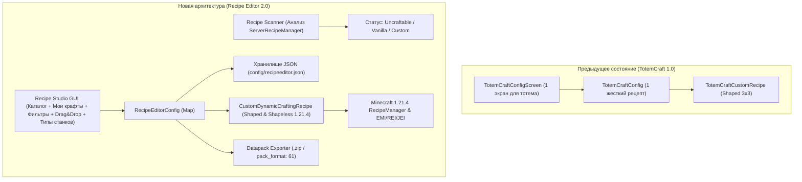

# AGENTS.md — План модернизации мода: Universal Custom Recipe Studio

Данный документ содержит детальную архитектуру, технический дизайн и пошаговый план перехода от специализированного мода (TotemCraft) к универсальной системе создания и редактирования рецептов для **любых предметов** (ванильных и модовых, включая предметы без существующих крафтов).

---

## 🎯 Цели и видение проекта

1. **Универсальность:** Возможность создать или изменить рецепт для абсолютно любого предмета из Minecraft и любых установленных модов.
2. **Чистый старт:** Мод не добавляет никаких встроенных крафтов по умолчанию. База рецептов изначально пуста, а сетка при входе чиста.
3. **Автоматическое определение (Auto-Detection):** Определение статуса предмета на лету через `RecipeManager`:
   - 🔴 **Uncraftable:** Предмет не имеет рецептов в игре (Тотем, Элитры, Седло, Яйцо дракона, модовые реликвии).
   - 🟡 **Vanilla / Modded:** Предмет имеет стандартный рецепт (с возможностью загрузить его в редактор и изменить).
   - 🟢 **Custom:** Рецепт уже создан или переопределен через мод.
4. **Визуальный GUI Редактор:** Удобный графический интерфейс с поддержкой Drag & Drop, поиском, фильтрами, списком «Мои крафты» и предпросмотром.
5. **Разнообразие типов крафта:** Поддержка верстака (Shaped, Shapeless), печей (Smelting) и камнереза.
6. **Экспорт в Датапак:** Экспорт созданных рецептов в стандартный чистый датапак `.zip` для использования на серверах.

---

## 🏗 Текущая архитектура vs Новая архитектура

---

## 📋 Пошаговый план разработки (Этапы)

### 🔹 Фаза 1: Рефакторинг структуры данных и хранилища (Data & Config Model)
* [x] **1.1. Класс `CustomRecipeData`:**
  * Поля: `id`, `resultItemId`, `resultCount`, `type`, `patternSlots`, `experience`, `cookingTime`, `enabled`, `overrideExisting`.
* [x] **1.2. Менеджер конфигурации `RecipeEditorConfig`:**
  * Хранение словаря `Map<String, CustomRecipeData>`.
  * Чистый старт без навязанных рецептов по умолчанию.
  * Методы: `addOrUpdateRecipe()`, `removeRecipe()`, `save()`, `load()`.

---

### 🔹 Фаза 2: Автосканер и инспектор рецептов (Recipe Scanner)
* [x] **2.1. Сервис `RecipeInspector`:**
  * Сканирование глобального `ServerRecipeManager` и `ClientRecipeBook`.
  * Точное определение статуса предмета (`UNCRAFTABLE`, `VANILLA_OR_MODDED`, `CUSTOM`).
* [x] **2.2. Механизм декомпиляции рецепта (`decompileRecipe`):**
  * Извлечение ингредиентов из существующего `RecipeDisplay` (Shaped, Shapeless, Furnace, Stonecutter) в слоты редактора по кнопке «Загрузить стандартный».

---

### 🔹 Фаза 3: Модернизация интерфейса (Modern Recipe Studio GUI)
* [x] **3.1. Панель фильтров каталога:**
  * Кнопки быстрых фильтров: `[Все]`, `[Без крафта]`, `[Кастомные]`, `[С крафтом]`.
  * Поиск по ID, локализованному имени и тегам.
* [x] **3.2. Верхняя панель выбора типа станка:**
  * Переключатель типов: `[Верстак 3x3]`, `[Без формы]`, `[Печь/Плавка]`, `[Камнерез]`.
* [x] **3.3. Расширенная сетка крафта с Drag & Drop:**
  * Перетаскивание предметов прямо в слоты сетки и результата.
  * Перетаскивание между слотами для быстрого дублирования.
  * Подсветка зоны сброса и выбранного слота.
* [x] **3.4. Окно «★ Список моих крафтов»:**
  * Интерактивный всплывающий список всех созданных крафтов с иконками, типами станков, кнопкой удаления и кнопкой «+ Создать новый крафт».

---

### 🔹 Фаза 4: Динамический движок рецептов (Dynamic Recipe Injector)
* [x] **4.1. Универсальный кастомный класс рецептов:**
  * `CustomDynamicCraftingRecipe` (Shaped и Shapeless) с поддержкой сопоставления (`matches`), создания предметов (`craft`) и отображения (`getDisplays`).

---

### 🔹 Фаза 5: Интеграция с EMI / REI / JEI и Экспорт в Датапак
* [x] **5.1. Регистрация в дисплеях модов рецептов:**
  * Реализация `RecipeDisplay` (Minecraft 1.21.4) для корректного отображения в ванильной книге рецептов, EMI, Roughly Enough Items (REI) и Just Enough Items (JEI).
* [x] **5.2. Экспорт в Датапак (Datapack Generator):**
  * `DatapackExporter` создает чистый zip-архив `config/RecipeEditorDatapack.zip` с `pack_format: 61` и JSON-рецептами.

---

## 🛠 Технический стек и зависимости

* **Minecraft:** `1.21.4`
* **Loader:** `Fabric Loader` (>= 0.16.x)
* **Fabric API:** Модули `fabric-resource-loader-v0`, `fabric-networking-api-v1`
* **JSON:** `Google Gson`
* **UI:** Minecraft DrawContext, Vanilla Screen API, Custom Drag&Drop Handler

---

## 📌 Чеклист для AI-агентов и разработчиков

| Задача | Статус | Примечания |
|---|---|---|
| Поддержка Drag & Drop в GUI | ✅ Завершено | Реализовано в `RecipeEditorScreen` |
| Создание модели данных `CustomRecipeData` | ✅ Завершено | `CustomRecipeData.java`, `RecipeTypeEnum.java` (лимит до 1000, независимое кол-во по типам) |
| Создание менеджера конфигурации | ✅ Завершено | `RecipeEditorConfig.java` (чистый старт) |
| Реализация `RecipeInspector` (автоопределение статуса) | ✅ Завершено | Прямой скан JAR-файлов модов + ванильный датапак + рантайм сервер/книга |
| Загрузка рецепта по ПКМ в каталоге | ✅ Завершено | Клик ПКМ по любому предмету загружает его рецепт в сетку |
| Разделение станков (Верстак, Без формы, Печь, Плавильня, Коптильня, Камнерез) | ✅ Завершено | 2 колонки кнопок, выровненные по ширине |
| Кнопка «Сохранить крафт» (зеленая) | ✅ Завершено | Сохранение только по явной кнопке, без автосохранения на выход |
| Добавление фильтра «Без крафта (Uncraftable)» в GUI | ✅ Завершено | Автосброс на [Все] при клике на фильтр |
| Динамическое поле ввода количества (до 1000) | ✅ Завершено | Отцентровано относительно слота результата |
| Очистка слотов по клавишам Delete / Backspace | ✅ Завершено | Очистка по горячим клавишам |
| Кнопка статуса «Мои крафты: ВКЛЮЧЕНЫ / ВЫКЛЮЧЕНЫ» | ✅ Завершено | Переключатель состояния мода |
| Экспорт в Датапак | ✅ Завершено | `DatapackExporter.java` (.zip экспорт) |
